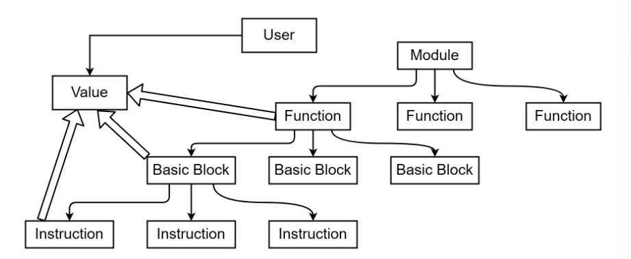

# LLVM学习

## 介绍

一种是在**内存中**的数据结构格式

一种是在磁盘二进制 **位码 (bitcode)** 格式 **`.bc`** 

一种是**文本格式** **`.ll`**

```c
int a=1;
int add(int x,int y){
    return x+y;
}
int main(){
    int b=2;
    return add(a,b);
}
```

```bash
$ clang main.c -o main # 生成可执行文件
$ clang -ccc-print-phases main.c # 查看编译的过程
$ clang -E -Xclang -dump-tokens main.c # 生成 tokens
$ clang -fsyntax-only -Xclang -ast-dump main.c # 生成语法树
$ clang -S -emit-llvm main.c -o main.ll -O0 # 生成 llvm ir (不开优化)
$ clang -S main.c -o main.s # 生成汇编
$ clang -c main.c -o main.o # 生成目标文件
```

```
@a = dso_local global i32 1, align 4 

; Function Attrs: noinline nounwind optnone uwtable 
define dso_local i32 @add(i32 %0, i32 %1) #0 {
  %3 = alloca i32, align 4
  %4 = alloca i32, align 4
  store i32 %0, i32* %3, align 4
  store i32 %1, i32* %4, align 4
  %5 = load i32, i32* %3, align 4
  %6 = load i32, i32* %4, align 4
  %7 = add i32 %5, %6
  ret i32 %7
}

; Function Attrs: noinline nounwind optnone uwtable 
define dso_local i32 @main() #0 {
  %1 = alloca i32, align 4
  %2 = alloca i32, align 4
  store i32 0, i32* %1, align 4
  store i32 2, i32* %2, align 4
  %3 = load i32, i32* @a, align 4
  %4 = load i32, i32* %2, align 4
  %5 = call i32 @add(i32 %3, i32 %4)
  ret i32 %5
}
```

下面给出一个Module的主要架构，可以发现，LLVM中几乎所有的结构都可以认为是一个 **`Value`** ，结构与结构之间的Value传递可以简单理解为继承属性和综合属性。而 **`User`** 类和 **`Use`** 类则是LLVM中的重要概念，简单理解就是，User类存储使用Value的列表，而Use类存储Value和User的使用关系，这可以让User和Value快速找到对方。



## 主函数与常量表达式

---

溜了溜了

放弃

还是用用四元式好了