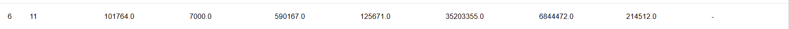

# 优化文档

原始版：



## 中间代码优化

### 常量计算

如果可以直接将值计算出来时，就直接计算出来。

```c
const int a[4] = {1,2,3,4};

int main() {
    int b = a[0] + 5;
    printf("%d", a[1]);
    printf("%d", a[1] * a[2]);
    return 0;
}
```

原来的中间代码：

```
######### Middle Code Start #########
GLOBAL VALUE: 
ARRAY a 1,2,3,4
GLOBAL STRING: 
###########################
###### BEGIN_main ######
###### func_size is 4######
Func_main:
### BLOCK_FUNC BEGIN
LABEL_1:
OFFSET 0 a T0
LOAD T1 T0
ADD T1 5 T2
DEF_VAR T2 b[0x4]
OFFSET 4 a T3
LOAD T4 T3
PRINT_INT T4
OFFSET 4 a T5
LOAD T6 T5
OFFSET 8 a T7
LOAD T8 T7
MUL T6 T8 T9
PRINT_INT T9
return 0
### BLOCK_FUNC END
###### END_main ######

######### Middle Code End #########
DIV 	: 0
MULT 	: 1
JUMP/BRANCH 	: 0
MEM 	: 4
OTHER 	: 15
FinalCycle : 31.0
```


