> 学号：20376158
>
> 姓名：安达楷
>
> 班级：212114

# 优化文档

这部分其实没有涉及到编码前的设计和编码后的修改。编码前的设计一般都比较简单，主要是优化后的debug过程比较痛苦。

## 中间代码优化

### 常量计算

如果可以直接将值计算出来时，就直接计算出来。在`visitExp`中，尝试计算一下，如果可以计算，那么就返回这个值，如果出错了，就`catch`这个报错，接着正常输出计算的中间代码。

或者是变量的值在全局都没有发生过变化的，也可以当做常量。新开一个类`NoChangeValue`，定义时将变量都存进去，维护一个`<ValueSymbol, int>`的键值对。当在翻译的时候变量出现在了等式左边，那就将其从表里拿走。中间代码翻译结束后，遍历所有的中间代码，将其中没有改变的变量替换为其值。

```c
const int a[4] = {1,2,3,4};

int main() {
    int b = a[0] + 5;
    printf("%d", a[1]);
    printf("%d", a[1] * a[2]);
    return 0;
}
```

原来的中间代码：

```
######### Middle Code Start #########
GLOBAL VALUE: 
ARRAY a 1,2,3,4
GLOBAL STRING: 
###########################
###### BEGIN_main ######
###### func_size is 4######
Func_main:
### BLOCK_FUNC BEGIN
LABEL_1:
OFFSET 0 a T0
LOAD T1 T0
ADD T1 5 T2
DEF_VAR T2 b[0x4]
OFFSET 4 a T3
LOAD T4 T3
PRINT_INT T4
OFFSET 4 a T5
LOAD T6 T5
OFFSET 8 a T7
LOAD T8 T7
MUL T6 T8 T9
PRINT_INT T9
return 0
### BLOCK_FUNC END
###### END_main ######

######### Middle Code End #########
DIV 	: 0
MULT 	: 1
JUMP/BRANCH 	: 0
MEM 	: 4
OTHER 	: 15
FinalCycle : 31.0
```

现在的中间代码：

```
######### Middle Code Start #########
GLOBAL VALUE: 
ARRAY a 1,2,3,4
GLOBAL STRING: 
###########################
###### BEGIN_main ######
###### func_size is 4######
Func_main:
### BLOCK_FUNC BEGIN
LABEL_1:
DEF_VAR 6 b[0x4]
PRINT_INT 2
PRINT_INT 6
return 0
### BLOCK_FUNC END
###### END_main ######

######### Middle Code End #########
DIV 	: 0
MULT 	: 0
JUMP/BRANCH 	: 0
MEM 	: 0
OTHER 	: 9
FinalCycle : 9.0
```

第二种优化：

```
int func(int a, int b){
    return a;
}

int main(){
    int x = 10;
    int y = 10;
    y = 100;
    y = func(x, y);
    printf("y is %d\n", y);
    return 0;
}
```

| DIV  | MULT | JUMP/BRANCH | MEM  | OTHER | FINAL CYCLE |
| ---- | ---- | ----------- | ---- | ----- | ----------- |
| 0    | 0    | 2           | 10   | 22    | 56          |
| 0    | 0    | 2           | 9    | 23    | 54          |

**但是实际上，这部分对于竞速测速没有任何优化。**


### 数据流图建立

参考课件：

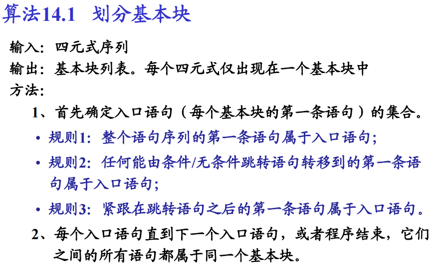

虽然之前已经是按照`basicblock`划分的基本块，但是当时的划分有一点随意，并没有按照基本块的规范划分，这里再重新规范一下。每个函数`Func`中包含一个`funcbody`的基本块，在这个基本块中有多个基本块。各个基本块之间有前驱和后继关系。

基本块的在下面的情况会发生更新：

- if语句。如果出现if时，首先确定好三个基本块，`ifBlock`,`elseBlock`,`endBlock`。在当前基本块下翻译`cond`，然后翻译下面的block时设置`curBlock`的值。
- for语句。如果出现for时，首先确定好四个基本块， `condBlock`, `bodyBlock`, `stepBlock`, `endBlock`。在当前基本块下翻译`forStmt1`，然后接着翻译下面的block。

这里重构了中端的基本块！！！重构后，每个基本块的结尾都是`jump anotherBlock`方便建立数据流图

### 无用代码删除

在建立了新的基本块后，发现有不少跳转都是可以合并的，如果跳转到的基本块只有一条跳转语句，那么就直接跳转到下一个基本块，用一个`while`循环不断遍历。

可以删除的无用代码：

- `jump`的多次跳转可以合并的情况
- 不会被经过的基本块。（这里，不能简单地判断前驱为0，因为可能存在一个链表）

同时，在我的中间代码中，存在着

- `JUMP后仍有代码`的情况，将`JUMP`后面的无用代码删除
- 基本块最后两个语句是`JUMP_NEZ`和`JUMP`两种情况，这两种`JUMP`的`target`都需要设置。

**MERGE_JUMP有问题，造成死循环**

在建图的时候可能形成环，需要处理。

>  在删除`std::vector<BasicBlock*> basicBlocks`中指定的`basicBlock`时遇到了问题！！！
>
>  使用c++的同学注意！千万不要在循环中修改循环的数组。
>
>  可以使用迭代器，也可以暂存需要删除的变量。

```c
std::vector<int> numbers = {1, 2, 3, 4, 5};
// 错误的示例：在循环中使用 erase()
for (auto it = numbers.begin(); it != numbers.end(); ++it) {
    if (*it % 2 == 0) {
        numbers.erase(it);  // 这里会导致迭代器失效
    }
}

// 正确的示例：使用有效的迭代器和更新迭代器
for (auto it = numbers.begin(); it != numbers.end(); ) {
    if (*it % 2 == 0) {
        it = numbers.erase(it);  // 使用 erase() 返回的有效迭代器
    } else {
        ++it;  // 更新迭代器
    }
}
```

在进行了上述操作后，中间代码的数量大大减小。


### 到达定义分析

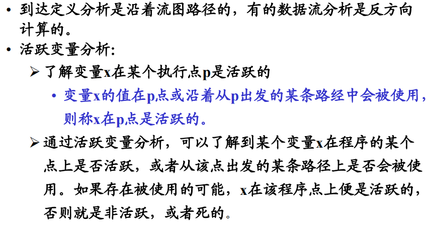

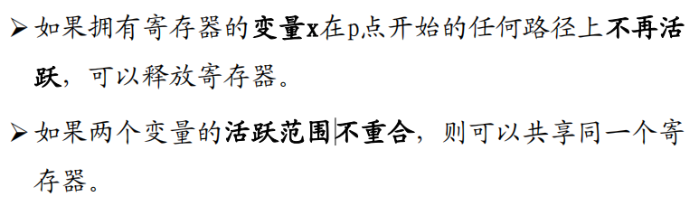

数据流方程：
$$
in[B]=use[B]\cup(out[B]-def[B])\\
out[B]=\cup_{B的后继基本块}in[P]\\
def[B]:变量在B中被定义或赋值先于任何对他们的使用，先定义后使用\\
use[B]:变量在B中被使用先于任何对他们的定义，先使用后定义
$$

**算法流程：**

1. 初始化：第一个基本块的$out[ENTRY]=\Phi$ ，所有的基本块的输出$out[B]$ 也是$\Phi$ 
2. 计算每个基本块的$kill[B]$和$gen[B]$
3. 根据$in[B]=\cup_{B的前驱基本块P}out[P]$ ，$out[B]=gen[B]\cup(in[B]-kill[B])$ ，计算每个基本块的$in[B]$，$out[B]$。如果某个基本块计算得到的$out[B]$与之前计算得到的不同，就循环2。

**实现**：

- 集合中的每个定义点，将其下标映射为一个二进制位数中的一位。
- $\cup$相当于是或运算，$-$相当于是将后者取反后，与前者按位与。
- $kill[B]$：**注意考虑的范围是这个函数中的所有基本块中**，比如B中有一个`d1:a=1;`，在另一个基本块中有一个`d3:a=3`，那么$kill[B]={d3}$ 

- $gen[B]=gen[d_n]\cup(gen[d_{n-1}]-kill[d_n])\cup...\cup(gen[d1]-kill[d2]-kill[d3]-...-kill[d_n])$

在函数中，每个`symbol`对应一个定义集`DataFlowDef`。遍历所有的block并填充这个定义集

每个代码，得到他的$kill[d_i]$和$gen[d_i]$ 

每个`block`，遍历所有的$kill[d_i]$，求并集即可得到$kill[B]$, $gen[B]$的话按照公式即可。

### 活跃变量分析

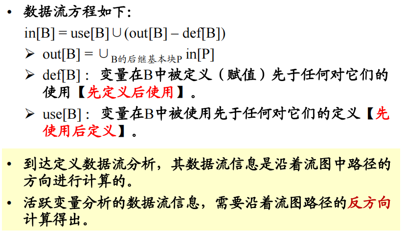

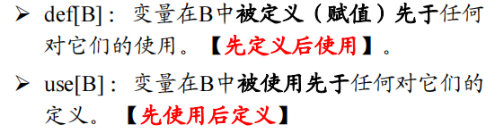

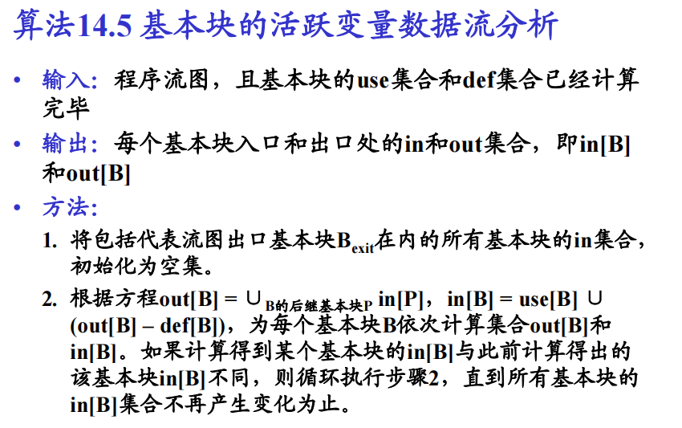

根据上述ppt内容设计代码：

- 首先求得每个block的use和def集合。求的过程中，如果变量是在式子的左侧那就加入`def`集合，如果变量在式子的右侧那就加入`use`集合。

- 根据程序流方程计算得到$out[B]$和$in[B]$

```
auto def = code->getDef();
if (def != nullptr) {
	auto name = def->name;
	this->defSet->insert(def);
}
auto uses = code->getUse();
if (uses != nullptr) {
    for (auto use : *uses) {
        if (use != nullptr) {
            this->useSet->insert(use);
        }
    }
}
```

### 死代码删除

死代码删除是建立在**活跃变量分析**基础之上的。

**算法：**

1. 对于基本块B，将$out[B]$中的变量放入一个集合$S$中，倒着遍历该基本块的所有代码
2. 如果当前代码：
   1. $def$不为空，且在$S$中：将他的$use$加入集合，并且将$def$移出。
   2. $def$为空：如可能是$printf$这种，只有$use$，将$use$加入。
   3. $def$不为空，且不在$S$中：表示不活跃，可以删除该代码

**注意：**

- 如果是`getint()`，需要读取。

- 变量是全局变量时不能删除

- 中间代码是函数调用或输入语句时也不能删除

**debug**：

- 我的数组偏移是一个临时的值，每次计算偏移的时候都会新建一个`TEMP`的变量，这样的话，如果是

  ```
  int a[2] = {1, 2};
  printf("%d", a[0]);
  --->
  OFFSET 0 a T0
  STORE 1 T0
  OFFSET 4 a T1
  STORE 2 T1
  
  OFFSET 0 a T2
  LOAD T3 T2
  PRINT_INT T3
  ```

  这时，进行死代码删除时就会将前面的赋值语句删除掉。

  所以我在这里进行了特殊判断，如果是地址变量的话，就不进行死代码删除。

### 常量传播与复写传播

（做了基本块内的传播和变量复写，但是有bug，最终未使用该优化)

常量可以跨基本块传播，变量只内块内传播

全局变量的值不能传播，因为可能在中途发生变化，比如函数调用的时候：

基本块内传播：

- 维护一个$def$的列表$q$，在遍历了一个代码，如果他的$def$不为空，那就插入。
- 遍历代码，取出他的$use$，倒着遍历$q$，如果$q$中有$use$，那么停止遍历。
  - 如果$q$中的这个$def$是常量赋值，那么就传给$use$
  - 如果是给变量赋值，那么从$q$的当前位置正向遍历，检查该变量赋值的代码右侧所使用的变量是否在之后被重新定义，如果没有，就将这个变量复写给$use$

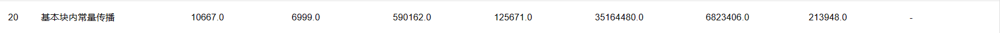

```
int main() {
    int a = 10;
    int c = a + 100;
    c = c + a * a;
    int b = a * 10 + c * 100;
    printf("%d\n", b);
    return 0;
}
```

优化后：

```
Func_main:
### BLOCK_FUNC [0] BEGIN
main:
PRINT_INT 21100
PRINT_STR str_0
return 0
### BLOCK_FUNC [0] END
```

跨基本块的常量传播：

- 每个函数都维护一个表，表示函数中的所有符号。他的值有三种`UNDEF`, `CONST`, `NAC`(NOT A CONST)三种。
- 每个基本块先处理自己的
- 处理一个基本块，处理后得到他的符号状态，然后传递给他的后继基本块。后继基本块

伪代码：

```c
M[entry] == init
do
    change = false
    worklist <- all BBs; ∀B visisted(B) = false
    while worklist not empty do
        B = worklist.remove
        visited(B) = true
        m' = fB(m)
        ∀B' ∈ successors of B
        if visited(B') then
            continue
        end
        else
            m[B'] ∧= m'
            if m[B'] change then
                change = true
            end
            worklist.add(B')
        end
    end
while(change == true)

```

由于在常量传播后，尽管中间代码的部分修改为了常数，但是还是没有减少执行的条数，需要对转换后的中间代码进行转换，比如`ADD 1 2 T0`直接转换为`DEF_VAL T0 3`，然后在下一轮的计算中，就会将`T0`视为常量继续新一轮的传播

**变量复写**

```c
int a = 10;
int main() {
    int b = a;
    int c = b;
    int d = c + b;
    printf("%d\n", d);
    return 0;
}

===
DEF_VAR a b[0x4]
ADD b b T0	// 变量c覆写了
PRINT_INT T0
PRINT_STR str_0
return 0
```

## 目标代码优化

### 图着色寄存器

主要由四个步骤：**构造、简化、溢出、选择**。（虎书中还有合并、冻结操作，但是我并没有涉及到，就不考虑了）

**构造**：构造冲突图

**简化**：一个点m，如果他的邻接点个数少于寄存器个数$K$，那么$G'=G-{m}$ 如果可以用$K$色着色，那么$G$也可以。

**溢出**：当简化过程中都是高度数的节点时，标记某个节点为需要溢出的节点。

**选择**：从一个空的图开始，重复地将栈顶节点添加到图中来重建原来的冲突图，弹栈的时候肯定是可以着色的。对于溢出的节点不进行着色

只考虑变量是局部变量或参数：

- 在冲突图中分配了寄存器的变量，是**跨基本块不变的**，所以直接返回对应的寄存器即可。

如果是临时变量或溢出变量的话：

- 如果`tempRegisters`中已经有了，那就直接返回。
- 如果没有，那就使用`OPT`方式释放一个寄存器并分配。

溢出变量本质上还是局部变量或者是参数的，所以需要由冲突图`ColorRegister`进行管理。

**只有以下情况才需要写回寄存器：**

考虑`globalRegisters`写回的情况：

- 函数调用前，写回所有的全局寄存器，以让新的函数使用。函数调用后，加载回全部的全局寄存器。

考虑`tempRegisters`写回的情况：

- 函数调用前，写回全部的寄存器。

- `return`时，写回`GLOBAL`，更新全局变量的值。
- `jump`跳转基本块时，写回`TEMP`和`GLOBAL`和`SPILL`。

### OPT

在OS课上学到的最优的替换策略，由于已经知道了所有的代码，所以可以预判未来最晚使用的变量，从而将其替换掉。

**处理局部基本块中的临时变量**，需要传入当前所在的block，然后得到现在的`Registers`中最晚使用的寄存器，选择将其替换出去。

### 引用计数

在计算中会产生很多的临时变量，他们很多时候只使用一次，没有必要继续保存。

在函数开始时，统计所有临时变量的使用次数，每当一行代码使用了这个临时变量，就`consumeUse`，当使用次数为0的时候，就直接把寄存器清空，而不再将寄存器保存回内存中。

这个方法对于testfile8有奇效。

### 乘除模优化

乘法优化就是将乘法运算替换为移位运算和加法运算，**本质上就是将一个数转换为2的幂**，$x=2^{k_i}+...2^{k_j}$

如果替换后的指令数量小于等于乘法的指令数量，那就替换，否则不进行替换。只针对于一个是立即数，一个是符号的情况有效，比如`b=a*10`，就可以写作：

```
sll $t4 $a1 1
sll $a0 $a1 3
addu $v1 $t4 $a0
```


除法优化参考了论文中的算法，本质上就是将$n/d$转换为$nm/2^{N+l}$ ，然后使用乘法和移位运算，由于除法占用20条指令，所以做了这个优化后肯定可以优化除法的指令条数。需要注意的是在编写代码时使用`int`是肯定会爆数据范围的，需要使用`long long`。

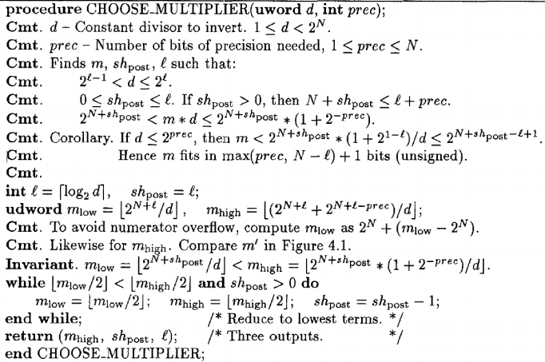

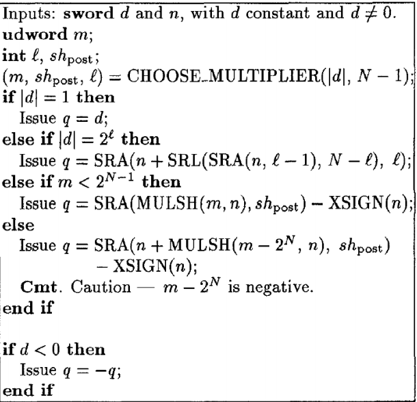

模优化是在除法优化的基础上做的，在做了除法优化后，得到的结果乘上除数，再用被除数减去这个值就等于模了。

### 窥孔优化

窥孔优化其实是效果仅次于寄存器分配的优化，并且在优化的过程中会感到效果好到出乎意料。

我就是靠着窥孔优化有3个点从50名左右进入了前10名，细节决定成败，积少成多。

- 跳转语句如果刚好跳到的是下一跳，那么可以删除。

  如果想要从中端进行删除的话，

  ```
  JUMP LABEL_19
  
  LABEL_19:
  xxx
  xxx
  
  
  JUMP LABEL_19
  ```

  删除前，第一处的`JUMP LABEL_19`会保存寄存器，这样在`LABEL_19`中用到时会从内存中加载，即使在LABEL_19中寄存器发生了变化也一样处理。

  但是删除后，如果内部寄存器发生了变化就会产生问题。

  所以进行判断，如果跳转到的block只有一个前驱，才删除这个`JUMP`。

- 删除无用的`move`，两个寄存器一样。

  ```
  move $t0 $t0
  ```

- 处理`sle`：

  ```
  li $t5 100
  sle $s0 $t0 $t5
  ```

  由于`sle`是伪指令，且占用较多指令数。可以优化为：

  ```
  li $t5 101
  slt $s0 $t0 $t5
  ```

  此时还可以利用`slti`进行优化

  ```
  slti $s0 $t0 101
  ```

  从原来的1+3条变为了1条。

  这里可能会存在立即数范围的问题，如果数据过大还是只能使用`slt`。

- `JUMP_EQZ`中窥孔，由于在跳转前，需要保存临时寄存器，在使用`JUMP_EQZ`时，又会根据某个值来判断是否跳转，即同一个变量，先`sw`后接着`lw`，这种冗余可以通过不将该寄存器写回的方式实现，实现方式也很简单，在`freeAllRegisters`中加一个参数`exceptSymbol`就解决了。

  这一点的效果出乎意料地好，由于每次循环都会减少一次`sw`和`lw`。

  

- 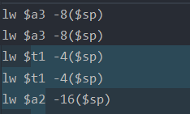

  生成的后端代码有时会重复出现这样的代码，将这种冗余代码去除。

- 代码中可能存在如下命令：

  ```
  li $a3 1
  seq $s2 $a3 $zero
  beqz $s2 LABEL_0
  ```

  需要6条指令

  而如果是

  ```
  li $a3 1
  bne $a3 $zero LABEL_0
  ```

  只需要2条命令

  同理：

  ```
  sne $s2 $a2 $zero
  beqz $s2 LABEL_0
  ---> beq
  ```

- move合并：第一条是临时变量，第二条是将这个临时变量赋值给变量，第一条的临时变量只会使用这一次，其实完全可以将第一二条进行合并。

  ```
  move $k1 $v0
  move $s6 $k1
  ```

  对于这样的进行合并：

  ```
  move $s6 $v0
  ```

## 优化结果

优化前：

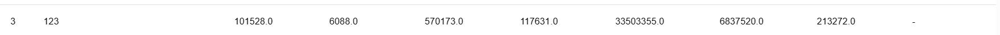

优化后：

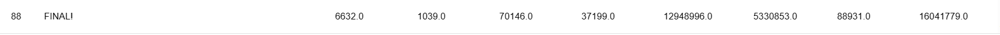

写文档时的排名：

32 11(并列第9)  8  7 18 38 28 32

很满意啦！

## 优化总结

汇总一下，其实我做的优化也不算多，中端是常量计算、死代码删除，后端是图着色寄存器、OPT、引用计数、乘除模优化、窥孔优化。

其中效果最好的是图着色寄存器、引用计数、除法优化、窥孔优化，中端不知道是我做的有问题还是怎么回事，效果都不是很好，尽管我花了很多时间在中端优化上，但是效果真不太行。

公开的样例testfile7感觉做循环不变式外提会有很好的效果，但是没时间做了就放弃了。

寄存器分配花了我最多的时间，效果其实不算太好，窥孔优化是最让我惊喜的，可能就只花了一下午吧，就把三个点从50名左右优化到了前十，效果十分的显著，比起这些大的优化，改动的地方其实也特别少，强烈建议后面做优化的同学要考虑考虑窥孔，细节决定成败，积少成多啊！

推荐的优化顺序的话：

- 先建流图，做活跃变量分析
- 做图着色寄存器分配、引用计数、OPT，或者不做图着色和OPT都行，那也不用做活跃变量分析了。
- 乘除法优化
- 窥孔优化

这些点做了肯定前50了，其他的优化我都没做过了，也不知道具体难度怎么样。但是只要是能针对循环和访存进行优化的，效果一定会很好。另外就是，可以从评测结果看到哪些命令有多少指令数，我甚至是快要结束才知道的。

要说优化卷吧，其实只需要做两三个优化就可以排名比较靠前了，但是在做的时候确实是盲人摸象，一开始没有什么优化的方向。
