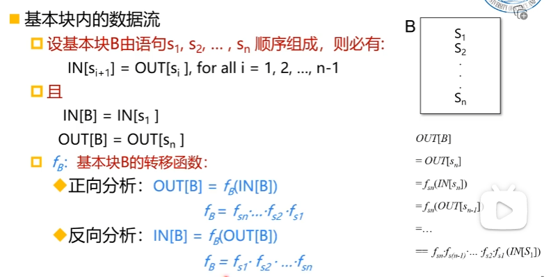
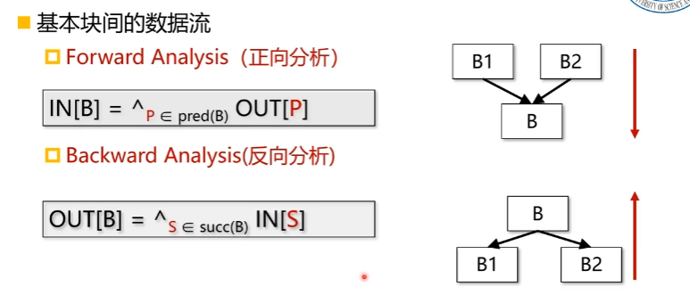
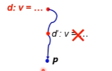

# 编译优化学习

## 数据流分析

## 到达定值分析

**定值(Definition)**：定义，或者是赋值

**到达定值：**如果存在一条从定值d到程序点p的路径，且此路径上d没有被“杀死”，则称 定值d到达程序点p，即此路径上没有其他定值d'对变量v重新定值

$$
比如：
u=v+w
$$
产生了一个u的定值d，并杀死了其他对u的定值

定制点前的数据流是$in[B]$ ，$out[B]=gen[B]\cup(in[B]-kill[B])$ 

