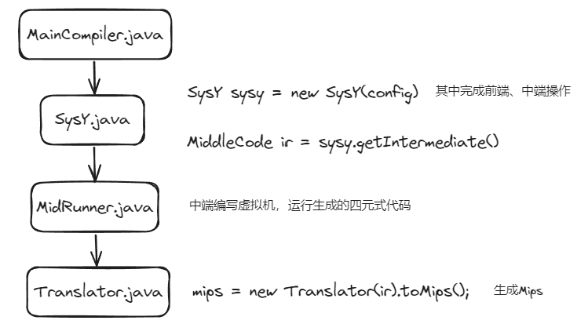
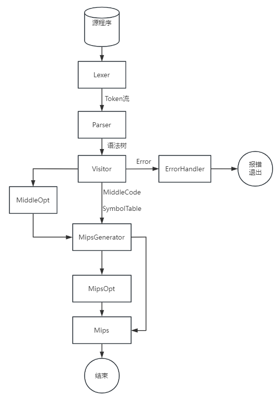
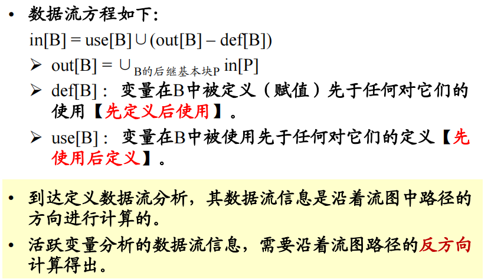
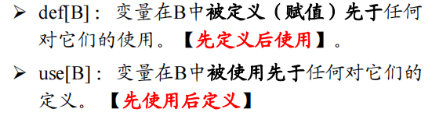
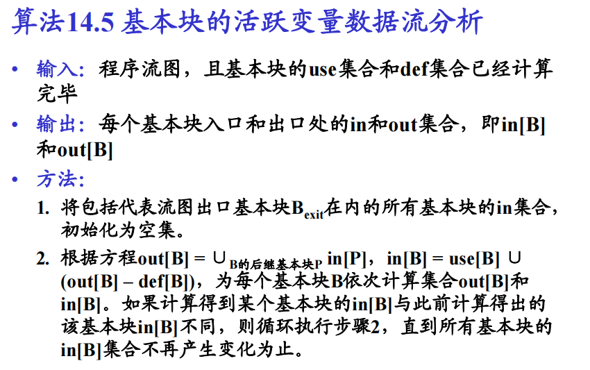
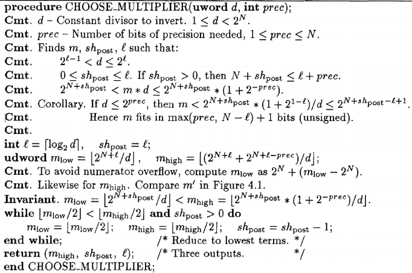
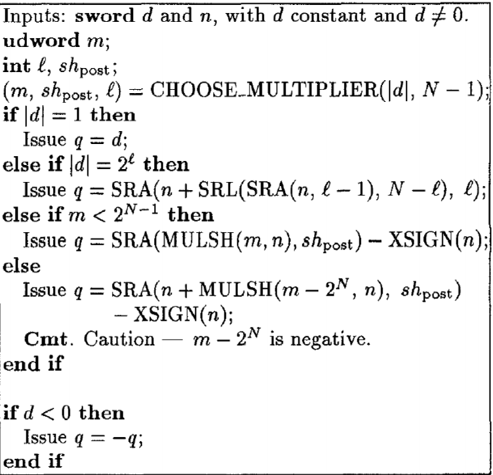
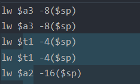
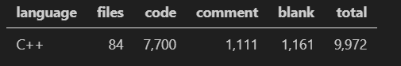

> 学号：20376158
>
> 姓名：安达楷
>
> 班级：212114

# 编译实验

[TOC]


## 参考编译器

前中后端部分主要参考DHY大佬的编译器：[dhy2000/Compiler2021: Compiler on SysY 2021, BUAA (github.com)](https://github.com/dhy2000/Compiler2021)

该编译器的代码结构可以说组织得非常好，并且可读性很强，很多模块划分地也非常得清晰，在一开始的时候选择了阅读他的代码参考学习。但是，由于个人的知识水平有限，在实际编写的过程中，是看一模块写一模块，导致一开始对于编译器其实没有整体的把握，对于后续要做的事浑然不知，如果一开始就能完整学习一个编译器的编写的话，肯定会对设计大有裨益。

### 总体结构

该编译器的组织结构和一般的编译器实现的流程类似：词法分析、语法分析、符号表设计、错误处理、中间代码生成、目标代码生成。

该编译器对于流程进行了简化，在遍历一次语法树的时候同时完成错误处理和中间代码生成。

### 接口设计

该编译器对于函数封装得很好，模块之间的组织调用也非常有条理。但由于要讲细节的话实在过于繁琐，就将大体的流程介绍一下。



该编译器还有一个亮点是他充分利用了命令行，专门编写了一个两百行的`Config.java`类来加载命令行的参数，根据参数来执行不同的操作，通过命令行来设置，这点给了我很大的启发。

```java
private static final String[] tokenArgs     = new String[]{"-s", "testfile.txt", "-T", "output.txt"};
private static final String[] syntaxArgs    = new String[]{"-s", "testfile.txt", "-S", "output.txt"};
private static final String[] errorArgs     = new String[]{"-s", "testfile.txt", "-E", "error.txt"};
private static final String[] pcodeArgs     = new String[]{"-s", "testfile.txt", "-V", "pcoderesult.txt"};
private static final String[] mipsArgs      = new String[]{"-s", "testfile.txt", "-O", "mips.txt"};
```

该编译器很值得学习的地方是他的`Operand`这个接口设计，所有的操作数都继承`Operand`，一开始我对这个设计不屑一顾，并没有采用他的这种设计，没有使用继承的写法，直到写到中端后端的时候，才体会得到`Operand`的好处。

然而，其符号表的设计只有一个`Symbol`，不是很美观，后续涉及到很多符号的时候，都是通过在`Symbol`中硬堆属性实现的，但是不得不承认，这样的设计非常的简单暴力，以至于我一开始设计了三个`Symbol`种类，最后真正有用的其实就只有一个类了。

### 文件组织

文件的组织方面，很多编译器都大差不差，分为`front`,`middle`,`backend`，其中很值得注意的是他的`src\middle\code`，每一个代码都占用一个文件，文件组织的格式非常的清晰，想要添加新命令的话，直接新建一个文件即可。

```
src
 ┣ autotest
 ┣ backend
 ┃ ┣ exception
 ┃ ┃ ┣ AddressNotAlignedException.java
 ┃ ┃ ┗ JumpTargetUndefinedException.java
 ┃ ┣ hardware
 ┃ ┃ ┣ Memory.java
 ┃ ┃ ┗ RegisterFile.java
 ┃ ┣ instruction
 ┃ ┣ optimize
 ┃ ┃ ┣ JumpFollow.java
 ┃ ┃ ┗ MipsOptimize.java
 ┃ ┣ Mips.java
 ┃ ┣ RegisterMap.java
 ┃ ┗ Translator.java
 ┣ compiler
 ┃ ┣ Config.java
 ┃ ┣ MainCompiler.java
 ┃ ┗ SpecialOptimize.java
 ┣ exception
 ┣ frontend
 ┃ ┣ error
 ┃ ┃ ┣ Error.java
 ┃ ┃ ┗ ErrorTable.java
 ┃ ┣ input
 ┃ ┃ ┗ Source.java
 ┃ ┣ lexical
 ┃ ┃ ┣ token
 ┃ ┃ ┃ ┣ FormatString.java
 ┃ ┃ ┃ ┣ Ident.java
 ┃ ┃ ┃ ┣ IntConst.java
 ┃ ┃ ┃ ┣ ReservedToken.java
 ┃ ┃ ┃ ┗ Token.java
 ┃ ┃ ┣ README.md
 ┃ ┃ ┣ Tokenizer.java
 ┃ ┃ ┗ TokenList.java
 ┃ ┣ syntax
 ┃ ┃ ┣ decl
 ┃ ┃ ┃ ┣ ArrInitVal.java
 ┃ ┃ ┃ ┣ Constable.java
 ┃ ┃ ┃ ┣ Decl.java
 ┃ ┃ ┃ ┣ DeclParser.java
 ┃ ┃ ┃ ┣ Def.java
 ┃ ┃ ┃ ┣ ExpInitVal.java
 ┃ ┃ ┃ ┗ InitVal.java
 ┃ ┃ ┣ expr
 ┃ ┃ ┃ ┣ multi
 ┃ ┃ ┃ ┣ unary
 ┃ ┃ ┃ ┗ ExprParser.java
 ┃ ┃ ┣ func
 ┃ ┃ ┣ stmt
 ┃ ┃ ┃ ┣ complex
 ┃ ┃ ┃ ┣ simple
 ┃ ┃ ┃ ┣ Stmt.java
 ┃ ┃ ┃ ┗ StmtParser.java
 ┃ ┃ ┣ Component.java
 ┃ ┃ ┣ CompUnit.java
 ┃ ┃ ┣ CompUnitParser.java
 ┃ ┃ ┣ ParserUtil.java
 ┃ ┃ ┗ README.md
 ┃ ┣ visitor
 ┃ ┃ ┣ CalcUtil.java
 ┃ ┃ ┗ Visitor.java
 ┃ ┗ SysY.java
 ┣ middle
 ┃ ┣ code
 ┃ ┣ operand
 ┃ ┃ ┣ Immediate.java
 ┃ ┃ ┗ Operand.java
 ┃ ┣ optimize
 ┃ ┣ symbol
 ┃ ┃ ┣ FuncMeta.java
 ┃ ┃ ┣ Symbol.java
 ┃ ┃ ┗ SymTable.java
 ┃ ┣ MiddleCode.java
 ┃ ┗ MidRunner.java
 ┣ utility
 ┃ ┣ MathUtil.java
 ┃ ┣ ReaderUtil.java
 ┃ ┗ ZipUtil.java
 ┗ Compiler.java
```

## 我の编译器

### 总体结构

整体结构和一般编译器类似：分为词法分析、语法分析、符号表设计、错误处理、中间代码生成、（中间代码优化）、目标代码生成、（目标代码优化）。

与其他编译器可能不太相同的是，在生成了语法树之后，遍历一遍语法树，同时进行错误处理和中间代码生成。



### 接口设计

宏观来看，每个部分之间是解耦的，比如，

- `Lexer`只需要接受源程序，生成`Token`流
- `Parser`只需要接受`Token`流，然后生成语法树
- `Visitor`只需要接受语法树，生成报错信息或者中间代码
- `MipsGenerator`只需要接受中间代码，生成目标代码`mips`。

但是在实际的编写过程中，由于设计原因，并没有实现完全的解耦。比如符号表，从中端到后端都在使用，在编写后端时对符号表的结构还进行了重构。

### 文件组织

```
src
 ┣ Backend
 ┃ ┣ Optimization
 ┃ ┃ ┣ ColorAllocator.cpp
 ┃ ┃ ┣ ColorAllocator.h
 ┃ ┃ ┣ GraphNode.cpp
 ┃ ┃ ┣ GraphNode.h
 ┃ ┃ ┣ MulAndDiv.cpp
 ┃ ┃ ┣ MulAndDiv.h
 ┃ ┃ ┣ PeepHole.cpp
 ┃ ┃ ┗ PeepHole.h
 ┃ ┣ Register
 ┃ ┃ ┣ Register.cpp
 ┃ ┃ ┣ Register.h
 ┃ ┃ ┣ RegisterAlloc.cpp
 ┃ ┃ ┣ RegisterAlloc.h
 ┃ ┃ ┣ Registers.cpp
 ┃ ┃ ┗ Registers.h
 ┃ ┣ Instruction.cpp
 ┃ ┣ Instruction.h
 ┃ ┣ MipsGenerator.cpp
 ┃ ┗ MipsGenerator.h
 ┣ Fronted
 ┃ ┣ Error
 ┃ ┃ ┣ Error.h
 ┃ ┃ ┣ ErrorTable.cpp
 ┃ ┃ ┗ ErrorTable.h
 ┃ ┣ Lexer
 ┃ ┃ ┣ Lexer.cpp
 ┃ ┃ ┣ Lexer.h
 ┃ ┃ ┣ Token.cpp
 ┃ ┃ ┗ Token.h
 ┃ ┗ Parser
 ┃ ┃ ┣ AST.cpp
 ┃ ┃ ┣ AST.h
 ┃ ┃ ┣ Parser.cpp
 ┃ ┃ ┗ Parser.h
 ┣ Middle
 ┃ ┣ Intermediate
 ┃ ┃ ┣ Immediate.cpp
 ┃ ┃ ┣ Immediate.h
 ┃ ┃ ┗ Intermediate.h
 ┃ ┣ MiddleCodeItem
 ┃ ┃ ┣ BasicBlock.cpp
 ┃ ┃ ┣ BasicBlock.h
 ┃ ┃ ┣ Func.cpp
 ┃ ┃ ┣ Func.h
 ┃ ┃ ┣ Label.cpp
 ┃ ┃ ┣ Label.h
 ┃ ┃ ┣ Middle.h
 ┃ ┃ ┣ MiddleBinaryOp.cpp
 ┃ ┃ ┣ MiddleBinaryOp.h
 ┃ ┃ ┣ MiddleCodeItem.cpp
 ┃ ┃ ┣ MiddleCodeItem.h
 ┃ ┃ ┣ MiddleDef.cpp
 ┃ ┃ ┣ MiddleDef.h
 ┃ ┃ ┣ MiddleFuncCall.cpp
 ┃ ┃ ┣ MiddleFuncCall.h
 ┃ ┃ ┣ MiddleIO.cpp
 ┃ ┃ ┣ MiddleIO.h
 ┃ ┃ ┣ MiddleJump.cpp
 ┃ ┃ ┣ MiddleJump.h
 ┃ ┃ ┣ MiddleMemoryOp.cpp
 ┃ ┃ ┣ MiddleMemoryOp.h
 ┃ ┃ ┣ MiddleOffset.cpp
 ┃ ┃ ┣ MiddleOffset.h
 ┃ ┃ ┣ MiddleReturn.cpp
 ┃ ┃ ┣ MiddleReturn.h
 ┃ ┃ ┣ MiddleUnaryOp.cpp
 ┃ ┃ ┣ MiddleUnaryOp.h
 ┃ ┃ ┣ PushParam.cpp
 ┃ ┃ ┗ PushParam.h
 ┃ ┣ Optimization
 ┃ ┃ ┣ DataFlow.cpp
 ┃ ┃ ┣ DataFlow.h
 ┃ ┃ ┣ DefinitionSet.cpp
 ┃ ┃ ┣ DefinitionSet.h
 ┃ ┃ ┣ NoChangeValue.cpp
 ┃ ┃ ┣ NoChangeValue.h
 ┃ ┃ ┣ PositiveSet.cpp
 ┃ ┃ ┗ PositiveSet.h
 ┃ ┣ Symbol
 ┃ ┃ ┣ Symbol.cpp
 ┃ ┃ ┣ Symbol.h
 ┃ ┃ ┣ SymbolTable.cpp
 ┃ ┃ ┗ SymbolTable.h
 ┃ ┣ Util
 ┃ ┃ ┣ Calculate.cpp
 ┃ ┃ ┣ Calculate.h
 ┃ ┃ ┗ Flatten.h
 ┃ ┣ Visitor
 ┃ ┃ ┣ Visitor.cpp
 ┃ ┃ ┗ Visitor.h
 ┃ ┣ MiddleCode.cpp
 ┃ ┗ MiddleCode.h
 ┣ Optimization
 ┃ ┗ Config.h
 ┣ Util
 ┃ ┣ Debug.h
 ┃ ┗ Exception.h
 ┗ main.cpp
```

## 文法解读

### 实验


完成A级：

```c
int a = 1, b = 0, c = 1;
if (a && b)
{
    printf("&& branch")
}
else if (a || b)
{
    printf("|| branch\n")
}
if (a && b || c)
{
    printf("&& || branch");
}
```

完成B级：

**注意：常量数组不能当做参数传入函数**

```c
//常量定义

//函数形参

//左值表达式

//函数实参
```

完成C级：

```c
//常量定义。
//变量定义。VarDecl → BType VarDef { ',' VarDef } ';' 
//函数定义。 FuncDef → FuncType Ident '(' [FuncFParams] ')' Block
/*
int/void
() (...)
{} {...}
*/

//语句stmt的情况
//1. LVal '=' Exp ';'
//左值表达式 LVal → Ident {'[' Exp ']'} 
//exp->addexp(有无+-) -> mulexp(有无*/%) -> unaryexp(primaryexp, 函数调用, +-unaryexp) -> primaryexp(有括号的exp, 左值， 数字)
//b = (a / 1) * (a + 2) * (a % a) + a - 1 + f0() - f1(a) * f2(a, a);

//2. [Exp] ';'

//3. Block

//4. 'if' '(' Cond ')' Stmt [ 'else' Stmt ]
//Cond->LOrExp
//LOrExp → LAndExp
//LAndExp → EqExp
//EqExp → RelExp | EqExp ('==' | '!=') RelExp
//RelExp → AddExp | RelExp ('<' | '>' | '<=' | '>=') AddExp

//5.'for' '(' [ForStmt] ';' [Cond] ';' [ForStmt] ')' Stmt 
//6.continue, break
//7.getint
```

## 词法分析

| 单词名称         | 类别码     | 单词名称 | 类别码   | 单词名称 | 类别码 | 单词名称 | 类别码  |
| ---------------- | ---------- | -------- | -------- | -------- | ------ | -------- | ------- |
| **Ident**        | IDENFR     | !        | NOT      | *        | MULT   | =        | ASSIGN  |
| **IntConst**     | INTCON     | &&       | AND      | /        | DIV    | ;        | SEMICN  |
| **FormatString** | STRCON     | \|\|     | OR       | %        | MOD    | ,        | COMMA   |
| main             | MAINTK     | while    | WHILETK  | <        | LSS    | (        | LPARENT |
| const            | CONSTTK    | getint   | GETINTTK | <=       | LEQ    | )        | RPARENT |
| int              | INTTK      | printf   | PRINTFTK | >        | GRE    | [        | LBRACK  |
| break            | BREAKTK    | return   | RETURNTK | >=       | GEQ    | ]        | RBRACK  |
| continue         | CONTINUETK | +        | PLUS     | ==       | EQL    | {        | LBRACE  |
| if               | IFTK       | -        | MINU     | !=       | NEQ    | }        | RBRACE  |
| else             | ELSETK     | void     | VOIDTK   |          |        |          |         |

### 编码前设计

```
Lexer/Lexer.h：定义Lexer类
Lexer/Lexer.cpp：类的函数具体实现
Lexer/Token.h: 定义Token类
```

`Lexer.cpp`： 

- 功能：读取文件，提取单词，返回单词串

- 元素：
  - `std::string token`：正在读取的token
  - `char c`：读取的字符
  - `int curLine`：当前行
  - `std::vector<Token*> tokens` ：所有的token

流程：

1. 读取文件
2. 每次先读取一个字符，再对这个字符进行判断，看是否需要进一步的处理。
3. 如果该次获取到了有效的字符串，根据这个字符串去查找他所属的`tokentype`，并将其加入到`tokens`中。
4. 最后输出时，将`tokens`输出到文件即可。

### 编码中的细节

**语言上的细节**：

- cpp中重载运算符需要使用友元的形式。

- `static`必须在类的外部定义

- `ifstream`

  ```c++
  class Lexer{
  private:
      std::vector<Token> tokens;
      std::ifstream& input;
  public:
      Lexer(std::ifstream& input_) : input(input_) {}
  };
  ```

  这里的input如果不是&就会报错，某种奇怪的原因，貌似是啥拷贝构造之类的。使用引用的方式就行。

- `const`放在函数后表示该函数不改变成员变量的值。

- `map.find()`函数

```c++
auto iter = str2type.find(str);
if (iter == str2type.end())	//找不到
{
    iter->second;	//得到str键对应的值
}
else {	//找得到
    
}
```

- `string.push_back`比`string+`快，因为`string+`会将后面的字符先构造成string对象。

**实现上的细节**

- 使用enum枚举Token，为了方便打印，将enum枚举的位置和tokenName的位置进行对应。
- 将`input`和`output`放哪的问题纠结了好一会，最后选择都在`main.cpp`中定义，在`lexer.cpp`中使用`extern`的形式使用，感觉这样很方便。
- 需要实现的`str2type`和`type2str`。后者一开始没有考虑到，因为要涉及到打印`type`。
- 对于换行的处理，每次读取一个字符，如果读到了换行符，就会将`curLine+1`
- **每次先读取一个字符**。意味着在每次`nextToken`开始的时候，`ch`就是已经在上一次循环最后读取到的。**很重要，忽略了的话就死循环了...**

### 总结

一开始感觉无从下手，一方面是第一次接触c++的项目，一方面是对于词法分析的要求还理解得不是很透彻。

我首先看了看c++项目的一般流程，学习了怎么使用`cmakelist`，以及在使用c++的类的时候的注意事项，还有很多语法上的细节都是在后面边做边搜的，感觉收获了不少了。

之后我在做之前先参考学习了课程组提供的pl0编译器的代码，以及其他优秀的编译器的设计，在广泛学习并构思后，我才开始了我的编码，感觉就会挺顺畅的。

## 语法分析

### 编码前设计

因为涉及到了对`tokenList`的操作，所以我在这里将之前设计的简单重构了一下，将`std::vector<Token*>`封装成了一个类`TokenList`，方便在`Parser`阶段调用类的方法进行操作

封装了`Parser`类，将`Lexer`解析得到的`tokenList`对象传入`Parser`中，执行`parse`方法开始递归下降解析。


1. 文法中存在左递归的文法，需要改写

```
MulExp -> UnaryExp | MulExp ('*' | '/' | '%') UnaryExp
MulExp -> UnaryExp { ('*' | '/' | '%') UnaryExp }

AddExp -> MulExp | AddExp ('+' | '−') MulExp
AddExp -> MulExp { ('+' | '−') MulExp }

RelExp -> AddExp | RelExp ('<' | '>' | '<=' | '>=') AddExp
RelExp -> AddExp { ('<' | '>' | '<=' | '>=') AddExp }

EqExp -> RelExp | EqExp ('==' | '!=') RelExp
EqExp -> RelExp { ('==' | '!=') RelExp }

LAndExp -> EqExp | LAndExp '&&' EqExp
LAndExp -> EqExp { '&&' EqExp }

LOrExp -> LAndExp | LOrExp '||' LAndExp
LOrExp -> LAndExp { '||' LAndExp }


```

2. Stmt的语法规则太复杂，可以新增非终结符，让结构更加清晰。

```
<AssignStmt> -> LVal '=' Exp
<ExpStmt> -> Exp
<BlockStmt> -> Block
<IfStmt> -> 'if' '(' Cond ')' Stmt [ 'else' Stmt ]
<ForStmt> -> 'for' '(' [AssignStmt] ';' [Cond] ';' [ForStmt] ')' Stmt
(原有的ForStmt改名为了AssignStmt)
<BreakStmt> -> 'break'
<ContinueStmt> -> 'continue'
<ReturnStmt> -> 'return' [Exp]
<InputStmt> -> LVal '=' 'getint' '(' ')'
<OutputStmt> -> 'printf''('FormatString{','Exp}')'
```

3. `MainFuncDef`和`FuncDef`类似，直接当做`FuncDef`来处理。
4. 考虑到将语法分析与后面的部分解耦，计划实现语法树。每个节点都是`Node`，因为是树，所以有`Node* parent`和`std::vector<Node*> children`的成员。
5. 因为`Node`可能是终结符和非终结符，所以具有两种成员，`Token* term`和`NoTerminal noTerm`

### 编码中的细节

- 要构建语法树
- `constdecl`和`vardecl`可以合并，用一个`isConst`来区分，同时`constdef`和`vardef`也可以合并。

- （不确定）`UnaryExp`中的`UnaryOp`我不知道包不包括`!`，同时如果想要判断是否是`PrimaryExp`，不知道怎么判断int，只好把这个写在`else`里面。

**----------------在与助教沟通后，对整体的语法树结构、以及其他设计进行了重构修改------------------**

- **不再使用`Node`来构建语法树，对于每种非终结符都设计单独的类，方便后续的处理，在`AST.h`中**
- 只将有具体含义的、重要的节点插入语法树中，而不是将所有的token都加入。
- 在输出结果时，对每种非终结符都重写其输出函数，在`AST.cpp`中实现。

- `Stmt`中的`LVal '=' Exp ';' `和`[Exp] ';'`和`LVal '=' 'getint''('')'';'`的判断。。。

```
 Exp → AddExp -> MulExp -> UnaryExp ->  '(' | LVal | Number | Ident '(' | '+' | '-' | '!'
 LVal -> Ident
 虽然Ident是重复的，但是可以使用Ident '('来特殊判断Exp
 
 剩下两个的话，可以先parseLVal()，再看后面的一个是不是'getint'。
```

- 像`LOrExp -> LAndExp { '||' LAndExp }`，一开始把`||`没有插入语法树，但是想想，还是得插入，并且得判断是不是`||`

- 为了控制输出，使用#define来控制

### 编码中错误

- 有些地方的换行符漏加
- 有处的指针未取值
- `UnaryExp → PrimaryExp | Ident '(' [FuncRParams] ')' `输出忘了`Ident`后面的部分
- 由于改写了文法取消了左递归，但是实际上还是需要写出来。


- 将`AddExp->MulExp {( '+' | '-') MulExp}`中的+-当做了unaryop，但其实只是简单的Token.
- stmt的[exp]可以以`!`开头吗？我现在没用

### 总结

这部分花了我可能一周的时间，从学习知识到设计到编码，一开始不明白怎么构建语法树，只使用一个`Node`的方式来构建，并且把每个token都存入语法树中，工作量非常的大。好在咨询了助教，及时地对代码进行了重构，采用每种非终结符对应一个类的形式，构建语法树时也简便不少，提前设计好真的太重要了！！！不过现在的设计感觉还是有些繁琐，每个非终结符都对应一个`parse`和一个重载输出`<<`，每个文件都几百行代码，个人感觉不太优雅，可能可以把其中的某几部分合起来，但是没有再细细设计，直接简单粗暴地编写程序了。

不过由于对后续的任务不是很清楚，不知道现在这种语法树的构建是否有问题，可能还需要进行重构。

## 错误处理

### 编码前设计

为了处理错误，定义Error类，包括错误的类型和错误所在的行数

为了记录错误，定义ErrorTable类，Error对象的集合。

纵览所有需要处理的错误类型，一一进行分析：

- 非法符号ILLEGAL_FORMATSTRING：在词法分析时对FormatString进行判断。**词法分析**
- 名字重定义DUPLICATE_IDENT: 函数名、变量名在当前作用域重复定义，需要建立符号表进行判断。**符号表**
- 未定义UNDEFINED_IDENT：根据符号表，判断是否未定义。**符号表**
- 函数参数个数不匹配MISMATCH_PARAM_NUM：根据符号表，可以判断定义的函数参数个数，和调用的参数个数。**符号表**
- 函数类型不匹配MISMATCH_PARAM_TYPE：同上判断**符号表**
- void函数有不匹配的return。VOID_MISMATCH_RETURN。**符号表**
- 有返回值的函数缺少return。LACK_RETURN**符号表**
- 不能改变常量的值CHANGE_CONST**符号表**
- 缺少分号：LACK_SEMICN：语法分析阶段得到。**语法分析**
- 缺少右小括号LACK_RIGHT_PARENT：语法分析阶段得到。**语法分析**
- 缺少右中括号LACK_RIGHT_BRACK：语法分析阶段得到。**语法分析**
- print中格式字符与表达式个数不匹配PRINTF_MISMATCH_NUM。**符号表**
- 非循环块中使用break, continue BREAK_CONTINUE_OUT_LOOP。**符号表**

词法分析与语法分析可对部分错误进行判断，在遍历语法树的过程中建立符号表，并进行额外的错误处理。当检测到错误时，将错误添加入错误表中。结束时按照要求对错误表进行输出。

- 符号表：

  建立树形的符号表，方便管理

  对于符号表，在进入`CompUnit`, `Block`, `FuncDecl`时新建符号表，并以当前符号表作为父节点。

  插入符号：检测当前级符号表中是否有同名变量，有则报错。
  
  查找符号：从当前级符号表向上查找到最近的。

### 编码时细节

- 对于`ErrorTable`，设计为单例模式，这个类在词法、语法、后续的代码生成中均有出现。

- 由于之前设计了`popExpect`的函数，所以在处理`i, j, k`与语法相关的错误时，可以都放在这个函数中处理。

- **错误g**：在涉及到`return`时，由于只需要考虑最后一行是否有`return`，大大简化了操作，就获取到`block`的最后一个item然后判断即可。错误行号是`}`的位置，而我并没有记录这个值，在AST中重新添加。

- 对于`visitBlock`，如果是函数的{}，那由于需要考虑形参也作用在这个里面，就不重新建符号表了。而如果是stmt中的`block`，那就需要重新建符号表了。

- **错误f**：考虑函数的返回值是否是空，以及最后一行的`returnStmt`中是否有`exp`，如果同时满足，则报错。

- **错误d**：实参和形参的类型匹配，计算实参的维度时，由于实参是`exp`，

- 当`funcFParam`在函数体中出现时，符号表中是`FuncFParamSymbol`，但是我为了判断这个变量是否是常量，我并不知道这个符号是`FuncFParamSymbol`还是`ValueSymbol`，因此如果想判断是否是常量就很麻烦。因此，我采用了多态的动态绑定，将`isConst()`方法写在父类`Symbol`上，在`ValueSymbol`和`FuncFParamSymbol`类里分别实现，这样，即使只从符号表中获取到指向`Symbol`的指针，也可以通过`p->isConst()`来得到是否是变量。

- 同上，在`PrimaryExp::getDim()`中，如果用到了函数参数的维度，那么也需要从符号表中拿到，会遇到和上一点一样的问题。

  ```c++
  auto valueSymbol = dynamic_cast<ValueSymbol*>(Visitor::curTable->getSymbol(name, true));
  int realDim = (int)(valueSymbol->dims.size()) - formDim;   // 实际传入的维度
  ```

  应改成：

  ```c++
  auto symbol = Visitor::curTable->getSymbol(name, true);
  int realDim = (int)(symbol->getDim()) - formDim;   // 实际传入的维度
  ```

  在`Symbol.h`中对将`getDim()`写成虚函数，然后实现动态绑定

### 编码时错误

- 发现了词法分析中的错误，设置当前token的行数时，不应该一直用curLine，因为有些会读到换行符导致curLine变化，应该在一开始处理时就将`curLine`先记录下来。

- 发现了语法分析中的错误。`a;`这句话会判断为`assignStmt`。

  在`parseStmt()`时

  ```
  LVal '=' Exp ';'
  [Exp] ';'
  LVal '=' 'getint''('')'';'
  ```

  这几个的FIRST都有可能是`LVAL`，我一开始只考虑了1,3，第二种情况没有考虑。

  首先`parseLVal`，将难处理的`LVal`读取，在这时只有可能是`LVal`，其他的情况在之前的if中已经得到判断。之后根据后一个符号是否是`=`，如果是就再判断1,3，如果不是，就只会是`expStmt`。

- 当`visitFuncDef`时，因为我想要把`FuncFParamSymbol`存在`FuncSymbol`中，所以是在`visitFuncFParam()`之后才新建了符号表，导致`FuncFParamSymbol`插入到了错误的符号表中。

- `FuncDef`的成员`FuncFParams`可能为空，获取`FuncDef`的参数数量时报错

- 当遇到`int f({`的情况是，由于我的语法分析中，在`parseFParam()`时是根据是否是右括号判断的，这样的话就会有问题，改成了根据是否是`INT`来判断

- 在`visitFuncDef()`中，我在得到最后一个`blockItem`后，没有考虑会有`blockItem->decl`的情况，只考虑了`stmt`，导致如果出现

  ```c++
  int f(){
      int a;
  }
  ```

  就会出现错误。

### 总结

- **符号表的最终设计与设计前没变，即采用树形的结构创建**

- **符号项的设计**：符号基类、函数形参符号、函数符号、值符号。下面列出主要的属性。

  - 符号基类

    ```c++
    class Symbol{
    public:
        std::string name;
        BasicType basicType;    // 默认都是int
        virtual bool isConst() const = 0;
        virtual int getDim() const = 0;
    };
    ```

  - 函数形参符号

    ```cpp
    class FuncFParamSymbol : public Symbol  {
    public:
        std::vector<int> dims;
        ValueType valueType;
        
        bool isConst() const {
            return false;
        }
        int getDim() const {
            return dims.size();
        }
    };
    ```

  - 函数符号

    ```c++
    class FuncSymbol : public Symbol {
    public:
        int num;
        std::vector<FuncFParamSymbol*> funcFParamSymbols;
        
        bool isConst() const {
            return false;
        }
        int getDim() const {
            return -100;
        }
    };
    ```

  - 值符号

    ```cpp
    class ValueSymbol : public Symbol {
    public:
        ValueType valueType;
        std::vector<int> dims;   //具体维度
        std::vector<int> initValues; //展开后的一维值
        int initValue;
        bool isConstValue;
        
        bool isConst() const {
            return isConstValue;
        }
        int getDim() const {
            return dims.size();
        }
    };
    ```

- 这一部分比较困难的一部分是维度的确定和维度的对应。确定维度时，由于是`Exp`的语法成分，而真正包括了维度信息的是在`LVal`中，所以需要不断地向里面挖，我采用的就是这种比较暴力的方式。维度的对应涉及到实参的维度和形参的维度，对于实参的维度需要格外注意，比如

  ```c++
  int a[10];
  f(a);	//此时传入的就是一维的
  int b[10][20];
  f(b);	//此时传入的就是二维的
  f(b[0]);	//此时的b就是一维的
  ```

  **实参真正传入的维度=符号表中的维度 - 实参看起来的维度**

## 中间代码生成

### 编码前学习

一开始想使用llvm->mips，但是一位大佬劝退，感觉难度会很大，采用四元式。

`(op, arg1, arg2, result)`

```
x = y + z表示为：
+, y, z, t1 -> t1=y+z
=, t1, , x -> x=t1
```

- 主函数
- 赋值语句

```
// a = num[0]
[], num, 0, t1
=, t1, , a
```

二维数组需要展成一维

- 条件语句

```
// if (x > y) then z = x + y 
// else z = x - y
>, x, y, t1
jnz t1 L
jmp M
L
+, x, y, t2
=, t2, , z
jmp N
M
-, x, y, t3
=, t3, , z
N
```

- 循环语句

```
// while (x < y) do x = x + 1
L
<, x, y, t1
beq, t1, 0, M
+, x, 1, t2
=, t2, , x
jmp L
M
```

```
// for (i = a; i < b; i = i + 1 ) {
// 		x = x + 1;
// }

=, a, , i

L
<, i, b, t1
beq, t1, 0, M
...	//x = x + 1;
+, i, 1, t2
=, t2, , i
jmp L

M
```

- 函数调用

```
// f(x, y)
=, x, , t1
param, t1, , 	//t1的地址压入栈
=, y, , t2
param, t2, , 	//t2的地址压入栈
call, f, , 		
```

- 读入和输出

```
// b=getint()
getint, , ,b

// printf("%d hello", x);
print_int, x, , 
print_string, hello, , 
```

**Mips复习**

```
ADD rd, rs, rt
SUB rd, rs, rt
MUL rd, rs, rt
DIV rs, rt	//商存入LO，余数存入HI
SLT	rd, rs, rt	

//存取指令
LW rt, offset(base)	 // LW $t1, 4($t2)
sw rt, offset(base)	 // SW $t1, 4($t2)

//分支指令
BEQ rs, rt, offset	// if(rs==rt) PC=PC+offset
J target	//跳转到target

```


### 编码前设计

结合教程的参考设计和mips，我们将中间代码分类：

- 变量定义。

- 二元运算。两个源操作数，一个目标操作数。
- 一元运算。一个源操作数，一个目标操作数。
- 偏移寻址。访问数组元素
- 读写内存。
- 函数相关。定义、调用
- 跳转。条件跳转和无条件跳转

- 输入输出

```
= ADD
- SUB
MUL
DIV
MOD
NOT
```

每一个中间代码都是一个对象，我们将其封装成类`MiddleCodeItem`

有一个中间代码的列表类`MiddleCode`，存储所有的中间代码，并进行中间代码的生成。

在`Visitor`遍历代码时生成中间代码并添加进入列表

下面一步步进行分析与设计：

- 变量定义

  全局变量，局部变量，字符串常量

  对于`int a = 1`分为两步，`int a;`和`a=1`。因此可以将此处的操作分为两个`DEF_VAL`和`SET_VAL`。**这样设计不好，由于会有const的存在，所以最好就一步到位，不然会有点歧义？因此这一步就直接变为`DEF_VAL 1 a`**

  对于全局变量和常量来说，值是需要提前就直接算好的，但是对于局部变量来说，值是需要写成mips在运行时执行的。

  对于数组来说不太好直接赋值，所以以繁化简。如对于`int a[10] = {1, 2}`，就分为`int a[10]`和`a[0]=1`和`a[1]=2`三步。因此此处的操作可以分为`DEF_ARR_BEGIN`，`SET_VAL`和`DEF_ARR_END`

  ```
  op		x		y		z
  DEF_VAL	1				a
  DEF_ARR_BEGIN			a[10]
  DEF_ARR_END				a[10]
  SET_VAL	1				a
  ```

- 一元计算

  ```
  a = 10;
  > ASSIGN a, 10		=
  ```

- 二元计算

  ```
  a = b + c;
  ADD b, c, a	+
  SUB			-
  MUL			*
  DIV			/
  MOD			%
  GT			>
  GE			>=
  LT			<
  LE			<=
  EQ			==
  NE			!=
  ```

- 偏移寻址

  ```
  a[10]
  OFFSET t1 10(a)
  ```

  这块还没想好怎么做。

- 读写内存

  ```
  LOAD, address, dst
  SAVE, address, src
  ```

- 函数相关

  主要包括三部分，函数名、函数参数、函数体

  由于函数跳转的时候是跳转到函数体执行，

  ```
  int func1(int a, int b)
  {
  	return c;
  }
  
  FUNC_BEGIN func1
  FUNC_END func1
  
  
  RETURN c
  ```

- 跳转

  对于跳转指令来说，只会有这些情况会跳转：1. 函数调用 2. 循环 3. 条件分支。将这几种的入口封装为一个类`BasicBlock`，其具有`Label`属性，其中间代码就是label

  ```
  JUMP label
  EQZ_JUMP var label	//如果var为0则跳转到label
  ```

对于每个类别的中间都写为一个类，都继承`MiddleCodeItem`类，成员就是其操作数，重写每个类的输出，即对应的中间代码。

**整体设计**

中间代码管理器存着所有的全局变量，全局数组，字符串，函数

| 类型     | OP                       | src1                 | src2        | ret        | 说明                                                         |
| -------- | ------------------------ | -------------------- | ----------- | ---------- | ------------------------------------------------------------ |
|          | GLOBAL                   | VAR_NAME/ ARRAY_NAME |             | VALUE      | 全局变量直接将他的值列出来                                   |
| 函数相关 | FUNC_BEGIN               |                      |             | FUNC_NAME  |                                                              |
|          | FUNC_END                 |                      |             | FUNC_NAME  |                                                              |
|          | CALL                     |                      |             | FUNC_NAME  |                                                              |
|          | PARAM                    |                      |             | VAR_NAME   | 形参的名字                                                   |
|          | PUSH_PARAM               |                      |             | VAR_NAME   | 如果是变量，就拷贝个tmp，然后push tmp。如果地址或者常数，就直接push |
|          |                          |                      |             |            |                                                              |
|          |                          |                      |             |            |                                                              |
|          |                          |                      |             |            |                                                              |
| 定义相关 | DEF_VAR                  | (VALUE)              |             | VAR_NAME   | 定义局部变量                                                 |
|          | ASSIGN                   | VALUE                |             | VAR_NAME   | 非数组变量的赋值，a = 8;                                     |
|          | DEF_ARRAY<br />END_ARRAY |                      |             | ARRAY_NAME | 定义局部数组                                                 |
|          | OFFSET                   | ARRAY_NAME           | var(字节数) | ADDRESS    | 数组元素的赋值<br />a[8] = 1;<br />OFFSET a 32 T<br />STORE 1 T |
| 内存相关 | STORE                    | VALUE                |             | ADDRESS    |                                                              |
|          | LOAD                     | ADDRESS              |             | VAR_NAME   | a[8];作为右值时，是需要返回值的<br />OFFSET a 32 T<br />LOAD T T2(返回值) |
| 计算相关 | ADD                      | src1                 | src2        | target     | 类似于Mips的设计                                             |
|          | SUB                      |                      |             |            |                                                              |
|          | MUL                      |                      |             |            |                                                              |
|          | DIV                      |                      |             |            |                                                              |
|          | MOD                      |                      |             |            |                                                              |
|          | ASSIGN                   | src1                 |             | target     |                                                              |
|          | POSITIVE                 |                      |             |            | 即unaryop的正号                                              |
|          | NEGATIVE                 |                      |             |            |                                                              |
|          | NOT                      |                      |             |            |                                                              |
| 跳转相关 | JUMP                     |                      |             | LABEL      |                                                              |
|          | JUMP_EQZ                 | src                  |             | LABEL      | 如果src为0时跳转到LABEL                                      |

全局变量和常量在编译时就计算出其值，由于这块没有涉及到错误处理，就直接单独写个计算类`Calculate`进行计算。


### 编码时细节

- **表达式具体值的计算**。在错误处理中只考虑了维度，没有考虑表达式的具体值、变量的具体值、数组的维度值。

  新增`Calculate`的类，其中的静态方法用于计算`Exp`的值。

- **与错误处理兼容**。在计算表达式具体值的时候，由于错误处理和计算是分开的，所以可能导致对错误的代码进行计算，会出错。比如下面这段代码，错误处理是在`visitInitVal`中的，即时有错误还是会进行计算。

  ```cpp
  visitInitVal(varDef->initval);
  int x = Calculate::calcExp(varDef->initval->exp);
  ```

  太傻了，纠结这个问题纠结了很久。在`visitInitVal`中正常的添加错误即可，同时在`visitInitVal`函数返回计算值就行，因为有错误的话就只会打印错误了嘛。因为这里其实只会涉及到`UNDEFINED`的问题，所以不用担心，遇到错误随便返回个值就行。

- **constDef和varDef**。怎么处理0呢？如果`a[10] = {1,2}`时，局部变量的话需要每个都赋值0吗？

- **局部数组的初始化**。首先是`DEF_ARR`，之后进行赋值。`OFFSET`通过偏移找到需要赋值的地址，然后`STORE`保存。可能这个会是变量，那这时就需要

- **局部变量的初始化**：不能直接计算。有可能是`getint()`或者是函数调用，需要在运行时计算。由于在处理时，会遇到函数可能返回`int`或是`ValueSymbol`的情况，考虑新建一个类，是立即数和符号的父类，记为`Intermediate`。然后用类似于递归下降的思路，逐步生成中间代码。同时，局部变量的初始化可能会出现`int a = b[0]`这种情况，在处理`LVal`时需要使用`OFFSET`和`LOAD`先得到`b[0]`，然后`def`。

  比如：
  
  ```cpp
  // 入口。其中sym是中间计算最后返回的操作数，可能是立即数，可能是valueSymbol。
  auto sym = visitExp(varDef->initval->exp);
  // 如果visitExp的值是立即数
  if (dynamic_cast<Immediate*>(sym) != nullptr) {
      auto def = new MiddleDef(MiddleDef::DEF_VAR, symbol, dynamic_cast<Immediate*>(sym));
      curBlock->add(def);
  }
  // 如果是ValueSymbol，即 DEF_VAR b a，将b的值赋给a，但由于b的值还未确定
  else {
      auto def = new MiddleDef(MiddleDef::DEF_VAR, symbol, dynamic_cast<ValueSymbol*>(sym));
      curBlock->add(def);
  }
  
  // 中间计算，以addExp为例，mulExp同理。逐步计算，逐步生成中间代码。其中getTempName是得到临时变量名字
  Intermediate *Visitor::visitAddExp(AddExp *addExp) {
  
      auto res = visitMulExp(addExp->mulExps[0]);
  
      for (int i = 0; i < addExp->ops.size(); i ++ ) {
          auto op = addExp->ops[i];
          auto middleCodeType = op->tokenType==Token::PLUS ? MiddleBinaryOp::ADD : MiddleBinaryOp::SUB;
  
          auto src1 = res;
          auto src2 = visitMulExp(addExp->mulExps[i + 1]);
  
          res = new ValueSymbol(getTempName());
          auto middleCode = new MiddleBinaryOp(middleCodeType, src1, src2, res);
          curBlock->add(middleCode);
      }
  
      return res;
  }
  ```
  
- **If语句的短路求值**：一开始没什么思路，看了助教讲的之后豁然开朗。

  1. 进入cond前，定义好trueLabel和falseLabel
  2. `LAndExp`接受`falseLabel`，只要有错就直接跳到`falseLabel`；`LOrExp`接受`trueLabel`，只要有对就直接跳到`trueLabel`。
  3. 以`LAndExp`为例，每执行一个`visitEqexp`就生成一个`JUMP_EQZ  (visitEqexp的返回值) falseLabel`的中间代码。

- **for语句**：

  1. 生成`loopBlock`和`endFor`，`cond`的trueLabel就是`loopBlock->label`，falseLabel就是`endFor`。
  2. `visitCond(cond, null, endFor);`
  3. `visitBlock`
  4. 最后`jump`回到`loopBlock`

- **数组元素的赋值语句**：由于我取数组元素时会使用`visitLVal`，这时会将数组元素的值`LOAD`存到一个临时变量中，而正确的应该是类似于数组的定义的方式，使用`STORE`某个值到这个地址的方式。也就是说，当数组元素作为左值时的赋值语句，需要与在右部时的处理不同。

## 目标代码生成

### 编码前设计

一个`MipsGenerator`类存放目标代码并生成，将每种目标代码设计为一种类，都继承自`Instruction`类

**内存管理**：（一开始没想好，后面边写边完善）

对于`symbol`的地址，之前并没有处理，在中间代码生成部分为每个`symbol`得到其在符号表中的地址

- 常量：不存，直接通过符号表查询。常量数组和变量处理方式一样。
- 字符串常量：从`.data`开始存
- 全局变量：从`$gp`开始存。
- 参数：前4个参数存储在参数寄存器`$a0~$a3`中，序号大于4的则以`$fp`为栈底，在内存中向上增长
- 局部变量：以参数区的栈顶作为局部变量区的栈底，向上增长
- 临时变量：以局部变量区的栈顶作为临时变量区的栈底，向上增长；当一个临时变量被使用后立即释放
- 局部变量：如果寄存器有位置放置在寄存器中其余则均放置在栈中，且进入函数前，就会为每个函数在栈中分配空间，该空间大小为其中间代码所包含的所有临时变量和局部变量的大小且该大小以及它们相对于函数栈针的偏移量会在生成汇编代码前通过递归遍历符号表计算得出，即栈针只在函数调用前后上下移动一次，在函数执行过程中不会移动，只会通过偏移量计算出栈中变量的位置进行寻址

sp在函数的栈底，数据向下增长，访问该函数的元素的地址时，就是`SP_ADDRESS-symbol.address`，但由于可能会有临时变量，**之前并没有分配临时变量的内存**，但是在操作时是需要压入栈中的，所以需要一个`curStackSize`来记录当前函数的栈的大小，如果有临时变量的话，就也给他压入栈中。

当调用函数时，就需要改变$$SP_{ADDRESS}=SP_{ADDRESS}-curStackSize$$ 

恢复时，就加回去。 


在`translateFunc`时，首先设置`curStackSize`表示当前函数的栈的大小，其中的参数向下增长，因此符号的起始地址就是`$sp-symbol.getAddress`，如果是数组，就是需要向上`+offset`。

**寄存器管理**：暂不考虑高级的寄存器分配，现在就简单地遍历所有的可用寄存器，如果有空闲就分配这个寄存器。

**大体流程**：遍历中间代码阶段生成得到的`字符串、全局变量、函数`，中间代码是存在`函数中的basicblock`中的，所以遍历其中的`middlecode`，根据`middlecode`的类型进行翻译。

**翻译MiddleDef**：target可能是普通变量，src可能是立即数，可能是全局变量，可能是局部变量。首先给target分配一个寄存器，src分配一个寄存器或返回已分配的寄存器。

- 如果是立即数，就直接`li`
- 如果是全局变量，就`lw $src offset($gp)`
- 如果是局部变量，就`lw $src offset($sp)`

**翻译UnaryOp, BinaryOp**：这部分比较简单，就简单地翻译中间代码即可

**翻译Offset**：这部分涉及到了数组的操作。

```
OFFSET 4 a T0
->
T0分配一个寄存器$t0
addu $t0 $sp (offset+a的偏移地址) 
addu $t0 $gp (offset+a的偏移地址)
```

**翻译lw**：如果涉及到立即数，就需要先加载下立即数。由于在中间代码时已经处理了OFFSET，所以`lw`和`sw`的偏移都是0就行

```
STORE 1 T0	(T0是地址)
sw 1 0(T0)
```

**翻译Jump**：简单

**翻译FuncCall**：

1. 保存寄存器的值
2. 保存`$ra`的值在`0($sp)`中
3. 移动`$sp`到被调用函数栈底，即`$sp=$sp-curStackSize-4`(4是由于要为`$ra`留空间)
4. 将实参按顺序压入栈中
5. `jal`调用函数
6. 回栈，操作`$sp`加回去
7. 恢复`$ra`，将`0($sp)`中的取出来
8. 如果有返回值的话，将返回值存到对应寄存器中

**函数参数传数组**：

- 形如`void func(int b[])`

  传入实参时，调用时`func(x)`，如果判断x是指针，就将他的类型设置为`POINTER`，得到其在当前函数栈中的地址偏移值，在压入参数的时候，如果判断到时`POINTER`类型的，计算出指针指向的实际的内存位置，将这个值压入参数的栈中。

  在被调用函数中使用形参时，他的类型是`FuncFParam`，地址的偏移也是在中间代码生成时就已经得到的，在给形参的值分配寄存器时会利用`$sp`来`load`，如果形参是数组的话，此时`load`到寄存器中的是数组的地址，比如使用`b[0]`时，如果是局部变量数组，就是算出他相对于`$sp`的偏移，如果是形参数组的话，就需要先将`b`的地址放入寄存器，然后`load $t0 offset(b)`来得到`b[0]`

- 如果传递的参数是参数数组的话，参数栈的位置的值就是数组的实际地址

**寄存器的保存**：

### 编码时细节

对之前的中间代码进行了调整：

- 在生成中间代码时，计算每个symbol的大小和偏移地址

- 为了计算函数的活动区需要的大小，每个`Func`中记录他的符号表`funcSymbolTable`，在函数定义的过程中，维护这个`funcSymbolTable`，并可以计算出其大小，同时可以求得每个symbol的偏移地址

- 如果中间代码直接出现`PUSH_PARAM`，那么在翻译成目标代码时，就无法知道将要调用的是哪个函数，栈空间无法确定。因此需要有一个开始调用函数的标记`TO_CALL`。同时，`PUSH_PARAM`分开写的话无法判断偏移的位置，挺麻烦的，因此修改为将所有的参数都写在call中，那也不需要`TO_CALL`，就一个`CALL`就行。

- `void`函数也需要有`return`语句，不然无法输出`jr $ra`

- 局部变量的地址需要从`4($sp)`开始存，`0($sp)`的位置留给`$ra`存。这样的话，而全局变量的偏移还是应该从0开始的，并且全局变量的地址起始值变成了

- 中间代码一开始忘记处理`break`和`continue`了。

  ```
  每进入一层循环，loopLabels就push进stmt2 begin的位置和endLoop
  每退出一层循环，就删去最后两个label
  当前循环中，易得，continue的话就是jump到loopLabels.size()-2，break的话就是loopLabels.size()-1
  {0
  	{2
  		{4
  		continue;	// jump 2
  		break;		// jump 3
  		}5
  	}3
  }1
  
  {0
  	{2
  		{
  			...不用考虑，因为已经弹出数组了
  		}
  		{4
  			continue;
  			break;
  		}5
  	}3
  }1
  ```

  

**临时变量的考虑**：之前没有考虑到临时变量的具体处理，临时变量并没有定义，内存中没有空间。打算在中间代码阶段生成临时变量时就做好记录，在生成目标代码时统一处理分配内存地址。

**输出字符串**：虽然可以使用`la`来加载标签地址，但是试了下会慢些，感觉可以直接通过`li`的方式得到地址。这就需要存储字符串的地址。

当使用`asciiz`时，每个字符串结尾有一个字节的`\0`

```
a: .asciiz "aa"
b: .asciiz "a"
的存储就是0x61006161
```

在得到全局变量的最大地址后，设置字符串的地址。字符串的大小需要注意的是，形如`\n`的转义字符只有一个字节，直接使用`.size`不行，需要单独编写函数，文法规定只会出现'\n'转义符，所以还好。

**数组传参**：

```
// 验证参数二维数组传参
int func(int x[]) {
    int a = 1;
    printf("in func %d\n", x[1]);
    return x[a];
}
int func2(int x[][2]) {
    int a = 1;
    printf("in func2 %d\n", x[1][1]);
    return func(x[1]);
}

int main() {
    int x[2][2] = {{1,2},{3,4}};
    int a = func2(x);
    printf("a is %d\n", a);
    return 0;
}
```

### 痛苦DEBUG

辅助测试：

>  在`for`循环中，全局变量的值改变后，没有写入内存中

跳转前保存所有寄存器

> C836: 多次调用之后，第一个输出值x发生了变化

在执行完调用函数之后，应该清空其寄存器，防止错误的写回。

> C837：`continue`和`break`跳转的标签位置错误。已改正
>
> 函数调用的问题：
>
> ```c
> int func(int a){
>     printf("a is %d\n", a);
>     return 0;
> }
> 
> int main(){
>     func(1);
>     return 0;
> }
> ```
>
> ，由于我的中间代码中，当判断到调用函数的返回值是int时，就新建一个临时变量，充当接受到的返回值。问题在于，我在函数一开始的时候保存所有的寄存器，此时这个临时变量返回值为0，就会覆盖掉传入的a的值，因此为0。

调用函数前保存所有寄存器，调用函数之后清空寄存器，跳转前保存所有寄存器，函数结束前清空所有寄存器，除了函数的basicblock外loop和branch的block都要保存寄存器。修改了保存寄存器的位置之后输出正确。

> C838: 参数如果是普通变量的时候，不应该写回内存中。！！！错啦，是可以写回的！！！普通变量的处理和实际变量的处理一样
>
> ```c
> int func(int a){
>     a = a - 1;
>     return a;
> }
> 
> int main() {
>     int x = func(7);
>     printf("x = %d\n", x);
>     return 0;
> }
> ```

将普通参数的类型设置为一般的变量就ok了

> C845：出错的情况：下面这段代码，输入一个数后，打印i=2。而如果注释掉`k=getint()`，那就正常了。
>
> 找到bug了，此时continue后，应该执行`i=i+1`，跳转前，保存并且清空了所有的寄存器，但是我在循环内部跳转到`stmt2`时没有加跳转语句，而是接着执行的，这就会导致`continue`后`i`可能被分配到错误的寄存器。
>
> ```
> for(i=0; i < 5;i=i+1 {
>     printf("i is %d\n",i);
>     k=getint();
>     x = 1;
> 
>     if(x>0){
>         continue;
>     }
>     i=i+1;
> }
> ```

在循环体内部到`forStmt2`之间加上`saveAllRegisters()`保存并清空所有寄存器，或者加上一条跳转语句。我选择后者，虽然会多一条jump，但是前者在中端貌似没法实现，后端也不太好实现。

> B815：全局二维数组没有初始化时应该为0，忘了设置了

> **B818：**看了很久的mips才看出来！！！如果出现k=k+1，此时的1需要写入寄存器中，另外，他替换掉的刚好就是k所在的寄存器。下面是我执行的代码片段，首先k得到属于他的寄存器，设为`$t1`，这时，1也刚好得到的是寄存器`$t1`，那么这时就会导致计算时`rd=1+1`的情况出现！！！
>
> ```c++
> // t1不是立即数，t2是立即数
> else if (t2 != nullptr) {
>     rs = RegisterAlloc::getInstance().allocRegister(dynamic_cast<ValueSymbol*>(src1));
>     rt = RegisterAlloc::getInstance().allocRegister(new NumSymbol(t2->value));
>     rd = RegisterAlloc::getInstance().allocRegister(dynamic_cast<ValueSymbol*>(target), false);
> ```

1. 寄存器写回时覆盖了基地址的值，`a[i]`计算`offset`的时候，会将a的地址值赋值给寄存器，在写回时，就将这个地址值写回到了`a[0]`的位置。因此，此时的对应关系是**一个寄存器对应着一个数组，这时不将该寄存器写回！！！因此在写回时判断symbol的维度，大于0则不写回**
2. **二元运算出现的寄存器符号覆盖的问题**：添加新的分配函数，如果此次将要分配的函数和指定寄存器相同，则分配的位置++。

> B823：continue相关错误。在每次跳转前保存所有寄存器。所以指令的顺序是
>
> - save reg
> - save reg
> - jump
>
> 在continue时，会生成一个jump指令，跳转到forstmt2的label。在`forstmt2`之后紧接着还有一个`jump to beginLoop`的跳转，此时会把旧的寄存器中的值写回内存中。这就是错误的原因。
>
> ```c
> int main() {
>     int a = 0;
>     for (; a < 8;) {
>         if (a == 2) {
>             a = a + 1;
>             continue;
>         }
>         a = a + 1;
>     }
>     return 0;
> }
> ```

如果判断`stmt2`为空的话，那么`forstmt2`的label就和`beginloop`一样，这样，在`continue`时，就会直接跳转到`beginLoop`。

> A806：形如下面这段代码中，问题主要出在a[1] = func()。我在中端翻译时是先visitLVal再visitExp，导致中间的函数调用会差在中间，造成寄存器的问题。调换顺序即可解决。
>
> ```c++
> int func(){
>     return 1;
> }
> int main(){
>     int a[2] = {1,2};
>     a[1] = func();
>     return 0;
> }
> ```

> 从代码优化回过头来debug。

**不足之处**：

- 中端和后端一起写的，耦合性太大了，并且由于没有写虚拟机测试中端，导致在写后端的时候频繁改动中端，导致牵一发而动全身，shi上堆shi


### 总结

中间代码加上目标代码差不多做了两周，从一开始不知道怎么进行内存管理，寄存器分配（虽然现在还是没搞寄存器分配），无从下手，在学习了其他编译器之后，慢慢地才有了思路。

一开始觉得llvm有点复杂，不如四元式简单直接，就直接上手四元式了，但是在设计的过程中遇到了不少的问题，中间也调整了很多次四元式的结构，形式上比较贴近mips的设计，在生成目标代码时就会容易些。另外，在写中端时很多地方都没有考虑到，因为实在不知道后面会怎么处理，比如函数调用时传递数组，参数变量的使用，二维数组传参一维数组等等，这些都是在写中端时，我想考虑但是不知道怎么写的地方就忽略了，事实证明这些点也是在写目标代码生成时遇到的大问题。最后，在勉强生成了一版能看的中端后，虽然还存在不少bug，但我直接开始写生成mips了。这也是四元式的一个大弊端：不知道自己写的对不对！虽然可以写个虚拟机来模拟运行，但是我觉得有点麻烦就没写了。而其他选择llvm->mips的同学就可以很好地检测自己中端的正确性。

虽然中端写的挺快的，写目标代码的时候就遇到了不少问题！在写后端的同时改中端！甚至改符号表等结构，非常的痛苦！牵一发而动全身，对此我这么评价四元式，自己拉的shi，还要给他捏一个好看的形状，哪有问题就东拉一点，西拉一点。可能是由于我一开始没有设计好，但这确实是我自己写四元式的感受，导致代码中出现了不少`if`，或者一个类只针对某一种情况的`特有变量`。这部分最难de的bug就是寄存器相关的，什么时候保存寄存器，什么时候清空寄存器不保存，怎么分配寄存器等等，这些都是我在一开始对寄存器的分配云里雾里的时候瞎写的，导致后面这块成了重灾区！在痛苦DEBUG的过程中，很多时候只能一行一行的看汇编代码来debug，一de就是一两个小时，不过虽然痛苦，写完整个目标代码生成之后对mips代码就非常熟悉了，对于程序运行的底层也更加理解了，更加理解了内存分配，寄存器管理等等内容。

（后面的优化就随缘咯）

## 优化

这部分其实没有涉及到编码前的设计和编码后的修改。编码前的设计一般都比较简单，主要是优化后的debug过程比较痛苦。

### 中间代码优化

#### 常量计算

如果可以直接将值计算出来时，就直接计算出来。在`visitExp`中，尝试计算一下，如果可以计算，那么就返回这个值，如果出错了，就`catch`这个报错，接着正常输出计算的中间代码。

或者是变量的值在全局都没有发生过变化的，也可以当做常量。新开一个类`NoChangeValue`，定义时将变量都存进去，维护一个`<ValueSymbol, int>`的键值对。当在翻译的时候变量出现在了等式左边，那就将其从表里拿走。中间代码翻译结束后，遍历所有的中间代码，将其中没有改变的变量替换为其值。

```c
const int a[4] = {1,2,3,4};

int main() {
    int b = a[0] + 5;
    printf("%d", a[1]);
    printf("%d", a[1] * a[2]);
    return 0;
}
```

原来的中间代码：

```
######### Middle Code Start #########
GLOBAL VALUE: 
ARRAY a 1,2,3,4
GLOBAL STRING: 
###########################
###### BEGIN_main ######
###### func_size is 4######
Func_main:
### BLOCK_FUNC BEGIN
LABEL_1:
OFFSET 0 a T0
LOAD T1 T0
ADD T1 5 T2
DEF_VAR T2 b[0x4]
OFFSET 4 a T3
LOAD T4 T3
PRINT_INT T4
OFFSET 4 a T5
LOAD T6 T5
OFFSET 8 a T7
LOAD T8 T7
MUL T6 T8 T9
PRINT_INT T9
return 0
### BLOCK_FUNC END
###### END_main ######

######### Middle Code End #########
DIV 	: 0
MULT 	: 1
JUMP/BRANCH 	: 0
MEM 	: 4
OTHER 	: 15
FinalCycle : 31.0
```

现在的中间代码：

```
######### Middle Code Start #########
GLOBAL VALUE: 
ARRAY a 1,2,3,4
GLOBAL STRING: 
###########################
###### BEGIN_main ######
###### func_size is 4######
Func_main:
### BLOCK_FUNC BEGIN
LABEL_1:
DEF_VAR 6 b[0x4]
PRINT_INT 2
PRINT_INT 6
return 0
### BLOCK_FUNC END
###### END_main ######

######### Middle Code End #########
DIV 	: 0
MULT 	: 0
JUMP/BRANCH 	: 0
MEM 	: 0
OTHER 	: 9
FinalCycle : 9.0
```

第二种优化：

```
int func(int a, int b){
    return a;
}

int main(){
    int x = 10;
    int y = 10;
    y = 100;
    y = func(x, y);
    printf("y is %d\n", y);
    return 0;
}
```

| DIV  | MULT | JUMP/BRANCH | MEM  | OTHER | FINAL CYCLE |
| ---- | ---- | ----------- | ---- | ----- | ----------- |
| 0    | 0    | 2           | 10   | 22    | 56          |
| 0    | 0    | 2           | 9    | 23    | 54          |

但是实际上，这部分对于竞速测速没有任何优化。


#### 数据流图建立


虽然之前已经是按照`basicblock`划分的基本块，但是当时的划分有一点随意，并没有按照基本块的规范划分，这里再重新规范一下。每个函数`Func`中包含一个`funcbody`的基本块，在这个基本块中有多个基本块。各个基本块之间有前驱和后继关系。

基本块的在下面的情况会发生更新：

- if语句。如果出现if时，首先确定好三个基本块，`ifBlock`,`elseBlock`,`endBlock`。在当前基本块下翻译`cond`，然后翻译下面的block时设置`curBlock`的值。
- for语句。如果出现for时，首先确定好四个基本块， `condBlock`, `bodyBlock`, `stepBlock`, `endBlock`。在当前基本块下翻译`forStmt1`，然后接着翻译下面的block。

这里重构了中端的基本块！！！重构后，每个基本块的结尾都是`jump anotherBlock`方便建立数据流图

#### 无用代码删除

在建立了新的基本块后，发现有不少跳转都是可以合并的，如果跳转到的基本块只有一条跳转语句，那么就直接跳转到下一个基本块，用一个`while`循环不断遍历。

可以删除的无用代码：

- `jump`的多次跳转可以合并的情况
- 不会被经过的基本块。（这里，不能简单地判断前驱为0，因为可能存在一个链表）

同时，在我的中间代码中，存在着

- `JUMP后仍有代码`的情况，将`JUMP`后面的无用代码删除
- 基本块最后两个语句是`JUMP_NEZ`和`JUMP`两种情况，这两种`JUMP`的`target`都需要设置。

>  在删除`std::vector<BasicBlock*> basicBlocks`中指定的`basicBlock`时遇到了问题！！！

```c
std::vector<int> numbers = {1, 2, 3, 4, 5};
// 错误的示例：在循环中使用 erase()
for (auto it = numbers.begin(); it != numbers.end(); ++it) {
    if (*it % 2 == 0) {
        numbers.erase(it);  // 这里会导致迭代器失效
    }
}

// 正确的示例：使用有效的迭代器和更新迭代器
for (auto it = numbers.begin(); it != numbers.end(); ) {
    if (*it % 2 == 0) {
        it = numbers.erase(it);  // 使用 erase() 返回的有效迭代器
    } else {
        ++it;  // 更新迭代器
    }
}
```

在进行了上述操作后，中间代码的数量大大减小。


#### 到达定义分析


数据流方程：
$$
in[B]=use[B]\cup(out[B]-def[B])\\
out[B]=\cup_{B的后继基本块}in[P]\\
def[B]:变量在B中被定义或赋值先于任何对他们的使用，先定义后使用\\
use[B]:变量在B中被使用先于任何对他们的定义，先使用后定义
$$

**算法流程：**

1. 初始化：第一个基本块的$out[ENTRY]=\Phi$ ，所有的基本块的输出$out[B]$ 也是$\Phi$ 
2. 计算每个基本块的$kill[B]$和$gen[B]$
3. 根据$in[B]=\cup_{B的前驱基本块P}out[P]$ ，$out[B]=gen[B]\cup(in[B]-kill[B])$ ，计算每个基本块的$in[B]$，$out[B]$。如果某个基本块计算得到的$out[B]$与之前计算得到的不同，就循环2。

**实现**：

- 集合中的每个定义点，将其下标映射为一个二进制位数中的一位。
- $\cup$相当于是或运算，$-$相当于是将后者取反后，与前者按位与。
- $kill[B]$：**注意考虑的范围是这个函数中的所有基本块中**，比如B中有一个`d1:a=1;`，在另一个基本块中有一个`d3:a=3`，那么$kill[B]={d3}$ 

- $gen[B]=gen[d_n]\cup(gen[d_{n-1}]-kill[d_n])\cup...\cup(gen[d1]-kill[d2]-kill[d3]-...-kill[d_n])$


在函数中，每个`symbol`对应一个定义集`DataFlowDef`。遍历所有的block并填充这个定义集

每个代码，得到他的$kill[d_i]$和$gen[d_i]$ 

每个`block`，遍历所有的$kill[d_i]$，求并集即可得到$kill[B]$, $gen[B]$的话按照公式即可。

#### 活跃变量分析







根据上述ppt内容设计代码：

- 首先求得每个block的use和def集合。求的过程中，如果变量是在式子的左侧且不在`use`集合中，那就加入`def`集合，如果变量在式子的右侧且不在`def`集合中，那就加入`use`集合。

- 根据程序流方程计算得到$out[B]$和$in[B]$

```
auto def = code->getDef();
if (def != nullptr) {
	auto name = def->name;
	if (!this->useSet->count(def)) {
		this->defSet->insert(def);
	}
}
auto uses = code->getUse();
if (uses != nullptr) {
    for (auto use : *uses) {
        if (use != nullptr) {
            if (!this->defSet->count(use)) {
            	this->useSet->insert(use);
            }
        }
    }
}

另外在计算in[B]时也有问题：！！！
auto in = new std::set<ValueSymbol*>();
in->insert(out->begin(), out->end());
for (auto symbol : *block->useSet) {
	in->insert(symbol);
}
for (auto symbol : *block->defSet) {
	in->erase(symbol);
}
顺序错了！！！
use[B] 并 (out[B]-def[B])
而我这里是(out[B]并use[B])-def[B]!!!不一样！
```

上面这个算法有问题！！！

如果出现`a = a`这样的代码，如果先判断$def$时，就会将$a$插入$defSet$中，后面判断$use$时就会有问题。

最后选择将def和use不加判断直接插入对应的集合中区。


#### 死代码删除

死代码删除是建立在**活跃变量分析**基础之上的。

**算法：**

1. 对于基本块B，将$out[B]$中的变量放入一个集合$S$中，倒着遍历该基本块的所有代码
2. 如果当前代码：
   1. $def$不为空，且在$S$中：将他的$use$加入集合，并且将$def$移出。
   2. $def$为空：如可能是$printf$这种，只有$use$，将$use$加入。
   3. $def$不为空，且不在$S$中：表示不活跃，可以删除该代码

**注意：**

- 如果是`getint()`，需要读取。

- 变量是全局变量时不能删除

- 中间代码是函数调用或输入语句时也不能删除

**debug**：

- 我的数组偏移是一个临时的值，每次计算偏移的时候都会新建一个`TEMP`的变量，这样的话，如果是

  ```
  int a[2] = {1, 2};
  printf("%d", a[0]);
  --->
  OFFSET 0 a T0
  STORE 1 T0
  OFFSET 4 a T1
  STORE 2 T1
  
  OFFSET 0 a T2
  LOAD T3 T2
  PRINT_INT T3
  ```

  这时，进行死代码删除时就会将前面的赋值语句删除掉。

  不要将地址值每次都重新新建一个临时变量，而是将这个地址值插入符号表中，每次都查找符号表，看是否已经有了这个变量。也就是说**将地址变量也纳入到寄存器分配的范畴中。

​	删除死代码时是从后向前分析，地址`a_1`被使用时肯定是`OFFSET xx a a_1， LOAD T0 a_1`的，这是一组，即当识别到的是`LOAD`时，将其当做`use`并且，可以跳过`OFFSET xx a a_1`这条语句，当定义时，肯定是`OFFSET xx a a_1，STORE xx a_1`的，此时在识别到`STORE`时，将其当做`def`来使用。


数组的地址，比如`int a[10]`，使用时`func(a)`，二维的`int a[2][2]`，

寄存器分配是为`symbol`分配，这时的`symbol`的类型就是`POINTER`而已，其他的处理是一样的，因此将`POINTER`类型的变量也插入符号表中，并记录。这样，也可以让指针一起参与死代码删除。


由于代码写的比较屎山，需要对`OFFSET`进行特别判断

- 如果`OFFSET`后跟着的是`LOAD`，那么这两条语句连在一起够成$use$
- 如果后面跟着的是`STORE`，那么连在一起构成$Def$
- 如果后面跟着的是`PUSH_PARAM(为了数据流分析新增的中间代码格式，后端不进行翻译)`，那么连在一起构成$use$。


几乎没有什么效果。


发现是数组开小了，代码的规模可能比较大。

**MERGE_JUMP有问题，造成死循环**

```
for (; 1 ;) {}
DoNotCall:
JUMP LABEL_2
### BLOCK_FUNC [2] END

### BLOCK [3] BEGIN
LABEL_2:
JUMP LABEL_3
### BLOCK [3] END

### BLOCK [4] BEGIN
LABEL_3:
JUMP LABEL_6
### BLOCK [4] END

### BLOCK [7] BEGIN
LABEL_6:
JUMP LABEL_7
### BLOCK [7] END

### BLOCK [8] BEGIN
LABEL_7:
JUMP LABEL_4
### BLOCK [8] END

### BLOCK [5] BEGIN
LABEL_4:
JUMP LABEL_2
### BLOCK [5] END
```

如上，可能形成环，需要处理。


#### 常量传播与复写传播

（做了基本块内的传播和变量复写，但是有bug)

常量可以跨基本块传播，变量只内块内传播

全局变量的值不能传播，因为可能在中途发生变化，比如函数调用的时候：

基本块内传播：

- 维护一个$def$的列表$q$，在遍历了一个代码，如果他的$def$不为空，那就插入。
- 遍历代码，取出他的$use$，倒着遍历$q$，如果$q$中有$use$，那么停止遍历。
  - 如果$q$中的这个$def$是常量赋值，那么就传给$use$
  - 如果是给变量赋值，那么从$q$的当前位置正向遍历，检查该变量赋值的代码右侧所使用的变量是否在之后被重新定义，如果没有，就将这个变量复写给$use$


```
int main() {
    int a = 10;
    int c = a + 100;
    c = c + a * a;
    int b = a * 10 + c * 100;
    printf("%d\n", b);
    return 0;
}
```

优化后：

```
Func_main:
### BLOCK_FUNC [0] BEGIN
main:
PRINT_INT 21100
PRINT_STR str_0
return 0
### BLOCK_FUNC [0] END
```

跨基本块的常量传播：

- 每个函数都维护一个表，表示函数中的所有符号。他的值有三种`UNDEF`, `CONST`, `NAC`(NOT A CONST)三种。
- 每个基本块先处理自己的
- 处理一个基本块，处理后得到他的符号状态，然后传递给他的后继基本块。后继基本块

```c
M[entry] == init
do
    change = false
    worklist <- all BBs; ∀B visisted(B) = false
    while worklist not empty do
        B = worklist.remove
        visited(B) = true
        m' = fB(m)
        ∀B' ∈ successors of B
        if visited(B') then
            continue
        end
        else
            m[B'] ∧= m'
            if m[B'] change then
                change = true
            end
            worklist.add(B')
        end
    end
while(change == true)

```

由于在常量传播后，尽管中间代码的部分修改为了常数，但是还是没有减少执行的条数，需要对转换后的中间代码进行转换，比如`ADD 1 2 T0`直接转换为`DEF_VAL T0 3`，然后在下一轮的计算中，就会将`T0`视为常量继续新一轮的传播

**变量复写**

```c
int a = 10;
int main() {
    int b = a;
    int c = b;
    int d = c + b;
    printf("%d\n", d);
    return 0;
}

===
DEF_VAR a b[0x4]
ADD b b T0	// 变量c覆写了
PRINT_INT T0
PRINT_STR str_0
return 0
```

### 目标代码优化

#### 图着色寄存器

主要由四个步骤：**构造、简化、溢出、选择**

**构造**：构造冲突图

**简化**：一个点m，如果他的邻接点个数少于寄存器个数$K$，那么$G'=G-{m}$ 如果可以用$K$色着色，那么$G$也可以。

**溢出**：当简化过程中都是高度数的节点时，标记某个节点为需要溢出的节点。

**选择**：从一个空的图开始，重复地将栈顶节点添加到图中来重建原来的冲突图，弹栈的时候肯定是可以着色的。对于溢出的节点不进行着色


变量是局部变量或参数：

- 在冲突图中分配了寄存器的变量，是可以跨基本块不变的，所以直接返回对应的寄存器即可。

如果是临时变量或溢出变量的话：

- 如果`tempRegisters`中已经有了，那就直接返回。
- 如果没有，那就使用`OPT`方式释放一个寄存器并分配。

溢出变量本质上还是局部变量或者是参数的，所以需要由冲突图进行管理。


考虑`globalRegisters`写回的情况：

- 函数调用前，写回所有的全局寄存器，以让新的函数使用。函数调用后，加载回全部的全局寄存器。

考虑`tempRegisters`写回的情况：

- 函数调用前，写回全部的寄存器。

- `return`时，写回`GLOBAL`，更新全局变量的值。
- `jump`跳转基本块时，写回`TEMP`和`GLOBAL`。

#### OPT

处理局部基本块中的临时变量，需要传入当前所在的block，然后得到现在的`Registers`中最晚使用的寄存器，选择将其替换出去。

#### 修改寄存器分配后的痛快DEBUG

> 本来是“痛苦”，打成了“痛快”，感觉还挺有意思。

> 函数传参时，参数没有加载便使用了。
>
> ```
> void func(int a) {
> 	printf("%d\n",a);
> }
> int main() {
> 	int b = 1;
> 	func(b);
> 	return 0;
> }
> ```
>
> 在`allocRegister`函数中，参数是已经分配了全局寄存器的，但是不能直接使用，需要先从内存中加载进入才行。

判断是否是参数，如果是参数的话就从内存中加载值。

> ```c
> for(; a<3 ;){
>     printf("%d\n",mycheck(a));
>     printf("%d\n", a);
>     a = a + 1;
> }
> ```
>
> 函数调用时，会替换掉`globalRegisters`中的寄存器值，虽然恢复寄存器时调用了`allocRegister`，但是这个函数会判断a还在全局寄存器中。

需要再函数调用前保存所有的寄存器，将此时的`活跃变量&为globalRegisters`中的保存入内存中，并在调用结束重新`alloc`。


对于数组变量以及数组指针，在建图的时候不考虑，比如

```
OFFSET 0 b ArraY_*$+|!123___b_0
LOAD T0 ArraY_*$+|!123___b_0
```

由于我的活跃变量中并未分析，因此将其放入临时寄存器中。


OPT策略中也没有考虑数组变量和数组指针，但是，是需要考虑的，因为数组变量和数组指针确实是占用了临时寄存器。

> [2021-C-11]报错原因：由于我之前符号的类型是`FUNCFPARAM`只表示参数数组，但是后来我将普通的变量也设置为了`FUNCFPARAM`，所以在判断的时候需要多设置一个维度。

> [2021-C-14]报错原因：
>
> ```
> int __fact(int x, int r) {
>  if (x <= 1) return r;
>  else return __fact(x - 1, (r * x) % 19260817);
>  return 0;
> }
> ```
>
> 在第一次经过`return r`的时候会从内存中取值，但是后面的`else`中的`r`并没有从内存中取值。
>
> 解决方法：在一开始翻译函数的时候，先从内存中加载所有参数的值。

> [2021-C-17]报错原因：
>
> 发现全局变量也分配到了`globalRegister`。
>
> 在建立冲突图时，不考虑全局变量。

> [2021-C-20]报错原因：
>
> ```
> int f(int a[]) {
> 	int i = 1;
> 	a[i] = 1;
> }
> ```
>
> 此时，形参数组a会分配到$a1寄存器，而i也会被分配到\$a1寄存器。让参数也与这些寄存器产生冲突。
>
> 因为之前在建立冲突图时并没有将数组变量作为活跃变量考虑。

> [2021-C-24]报错原因：建立冲突图时，该行代码的def和use和其活跃变量之间并没有产生冲突，因此将该行代码的def和use加入冲突集中。
>
> **[TODO]溢出的变量，在函数调用前后，没有正确地保存**
>
> 每个代码的codeActive都是对的，
>
> if () {
>
> ​	code1;
>
> }
>
> else {
>
> ​	code2;
>
> }
>
> `d`是溢出变量，如果code1中的活跃变量没有`d`，那么在函数调用的时候就不会保存`d`，并且在调用结束之后也不会恢复`d`，导致`code2`中的函数调用前就不会保存`d`到内存中。
>
> 得到该函数中，这行代码后的所有代码的use，作为活跃变量。

图着色寄存器分配时，将局部变量和参数与寄存器对应，构成`symbolToRegister`，溢出表示为`spillSet`

在翻译的时候，`allocRegister`判断如果满足了全局寄存器分配的条件，就调用图着色寄存器的`allocGlobalRegister`，然后将局部变量与寄存器对应的是`symbolToGlobalRegisters`

在翻译的时候，如果判断变量是局部寄存器，如果判断当前变量是溢出变量，就让溢出变量与寄存器对应`spillToRegister`。


在`translateMiddleOffset`函数中处理`OFFSET base offset ArraY....`，在这里得到`ArraY`的值，那么在寄存器分配中`dealWithReg`中，其实是不需要对这个`ArraY`进行任何处理的

在寄存器分配的时候，就将这个当做变量来处理就好了


数组变量的处理好像没必要是变量，这样的话，其实每次都需要`lw`，不如直接`addu`

地址变量就别存了，跨基本块直接free掉

#### 乘除模优化

乘法优化就是将乘法运算替换为移位运算和加法运算，**本质上就是将一个数转换为2的幂**，如果替换后的指令数量小于等于乘法的指令数量，那就替换，否则不进行替换。只针对于一个是立即数，一个是符号的情况有效，比如`b=a*10`，就可以写作：

```
sll $t4 $a1 1
sll $a0 $a1 3
addu $v1 $t4 $a0
```

除法优化参考了论文中的算法，本质上就是将$n/d$转换为$nm/2^{N+l}$ ，然后使用乘法和移位运算，由于除法占用20条指令，所以做了这个优化后肯定可以优化除法的指令条数。





模优化是在除法优化的基础上做的，在做了除法优化后，得到的结果乘上除数，再用被除数减去这个值就等于模了。

#### 窥孔优化

窥孔优化其实是效果仅次于寄存器分配的优化，并且在优化的过程中会感到效果好到出乎意料。我就是靠着窥孔优化有3个点从50名左右进入了前10名

- 跳转语句如果刚好跳到的是下一跳，那么可以删除。

  如果想要从中端进行删除的话，

  ```
  JUMP LABEL_19
  
  LABEL_19:
  xxx
  xxx
  
  
  JUMP LABEL_19
  ```

  删除前，第一处的`JUMP LABEL_19`会保存寄存器，这样在`LABEL_19`中用到时会从内存中加载，即使在LABEL_19中寄存器发生了变化也一样处理。

  但是删除后，如果内部寄存器发生了变化就会产生问题。

  所以进行判断，如果跳转到的block只有一个前驱，才删除这个`JUMP`。

- 删除无用的`move`，两个寄存器一样。

- 处理`sle`：

  ```
  li $t5 100
  sle $s0 $t0 $t5
  ```

  由于`sle`是伪指令，且占用较多指令数。可以优化为：

  ```
  li $t5 101
  slt $s0 $t0 $t5
  ```

  此时还可以利用`slti`进行优化

  ```
  slti $s0 $t0 101
  ```

  从原来的1+3条变为了1条。

  这里可能会存在立即数范围的问题，如果数据过大还是只能使用`slt`。

- `JUMP_EQZ`中窥孔，由于在跳转前，需要保存临时寄存器，在使用`JUMP_EQZ`时，又会根据某个值来判断是否跳转，即同一个变量，先`sw`后接着`lw`，这种冗余可以通过不将该寄存器写回的方式实现，实现方式也很简单，在`freeAllRegisters`中加一个参数`exceptSymbol`就解决了。

  这一点的效果出乎意料地好，由于每次循环都会减少一次`sw`和`lw`。

  

- 

  生成的后端代码有时会重复出现这样的代码，将这种冗余代码去除。

- 代码中可能存在如下命令：

  ```
  li $a3 1
  seq $s2 $a3 $zero
  beqz $s2 LABEL_0
  ```

  需要6条指令

  而如果是

  ```
  li $a3 1
  bne $a3 $zero LABEL_0
  ```

  只需要2条命令

  同理：

  ```
  sne $s2 $a2 $zero
  beqz $s2 LABEL_0
  ---> beq
  ```
  
- move合并：第一条是临时变量，第二条是将这个临时变量赋值给变量，第一条的临时变量只会使用这一次，其实完全可以将第一二条进行合并。

  ```
  move $k1 $v0
  move $s6 $k1
  ```

  对于这样的进行合并：
  
  ```
  move $s6 $v0
  ```

### 优化结果

优化前：


优化后：


写文档时的排名：

32 11(并列第9)  8  7 18 38 28 32

很满意啦！

## 总结

一学期的编译实验终于结束了，这学期在编译实验上的花的时间可以说相当的多了，从9月份放出第一个实验开始，感觉自己就一直在写编译实验。

刚开始还很迷茫，不知道如何下手，甚至连文法解读都看不懂。词法分析写的还算顺畅，不算太难，接着就马不停蹄接着写语法分析，**这时就陷入了第一个困难点：语法树的建立**。我这时还困惑于什么是语法树，担心自己语法树建的结构不对，导致后面的实验非常的困难，于是漫无目的地构思了很久，最后通过咨询助教才得到了解答。

国庆节前后我就开始了错误处理，参考了其他代码，我发现错误处理和中端代码可以一起做，但是我在做错误处理的时候还不知道怎么做中端代码生成，虽然遍历了语法树，但仍然需要重构许多内容。在做中端代码生成时就遇到了我的**第二个困难点：不知道后端代码怎么生成**。由于我选择的是四元式，导致代码是需要自己设计的，设计了类似于mips的代码，但是其实在写中端的时候完全不知道后端要怎么做，我就先写了一版简单的，打算在写后端的时候再完善，导致后面在写后端的时候反复地来到中端重构代码。

从十月中旬到十一月中旬，我一直在写中端代码和后端代码，由于我的四元式设计得不够好，所以导致这两者其实耦合地比较严重，中端更多的是为了后端生成服务的，而不是与后端独立的两个部分。在写后端的时候，**遇到了第三个困难点：不知道mips的机制**。虽然会简单地写mips，但是其实对于mips内部是如何内存管理的、如何分配寄存器这些问题，一开始还是非常的懵，后面也是学习咨询了很久才理解了。但是在写的时候还是遇到了很多的困难，函数的调用、数组的处理、寄存器的分配，这三块内容我感觉是写后端代码的几个难点，尤其是寄存器的分配，debug非常难de，经常需要用mars一行行调试mips代码来de，一de就是一两个小时。好在，最后还是写完了，实现功能的那一刻真的非常有成就感！

之后十一月中旬到十二月中旬，就开始了我的优化。然而一开始就面临着要重构中端代码。因为我在写中端的时候对基本块的概念不是很清晰，虽然划了，但没完全划，不符合规则，导致我花了挺多时间重构基本块的。重构后就顺其自然地建立了数据流图，之后就进行了数据流分析，活跃变量分析、到达定义分析（没用上），然后做了死代码删除、常量传播（虽然失败了）。死代码删除时，也碰到了一个bug好几天没解决，最后多亏了助教哥哥的帮助。后端优化方面，主要就是做了寄存器分配，图着色寄存器分配应该做了我有两周的时间，非常的痛苦。一开始不知道怎么做图着色，参考虎书的内容，他是用了虚拟寄存器，但是我之前没用又不想改架构了，就没用他的方法。不过核心思想还是差不多，先对局部变量和参数建立了冲突图，然后用全局寄存器对冲突图的节点进行染色，对其他的变量分配临时寄存器。图着色虽然做了，但是发现testfile8还是没过！然后又把临时变量用了引用计数，在替换时使用OPT策略进行最优替换。还是没过！最后发现是建立冲突图时变量太多导致运行时太慢的TLE！改了之后就有了不错的速度。然而，最后测试了下，真正最起作用的还是引用计数！！！可能是因为我的图着色没做“合并”的操作？之后没啥时间了，做了点简单的优化：乘除模优化和窥孔优化。除法优化的效果很不错，窥孔优化的效果更是惊人，真正理解了什么叫细节决定成败，少量的优化积少成多，也能取得非常不错的优化效果。

上面对整个编译实验的过程做了一个总结。

先提点小意见吧，一方面就是希望前端可以使用自动化的工具，而不是只能用递归下降进行编写，现在学界和业界编译器的重点都是在后端，希望可以减轻前端和中端编写的压力，能够把时间腾出来多做些后端相关的优化。另一方面，希望能在指导书中多给一些设计的指导，比如涉及到mips的函数调用、数组、寄存器分配等知识，这块对于基础较差的同学很难理解（比如我），我就是在看了很久其他资料后才懂的，并且我身边还有一些也没搞懂这个问题的同学来询问我，希望课程组可以把指导书的讲解更全面细致一些。

从零开始写一个编译器还是很有成就感的，虽然整个代码有点shi，有许多地方都是由于没有提前设计好导致的，不过这也让我积累了很多的经验，一定是要设计先行，多想再写。同时，之前从没有个人接触过上千行的项目（web开发项目除外），个人感觉难度梯度有点大，之前两个学期的CO和OS都没有这么大的工程量和代码量，突然之间上手很难不写出屎山代码。这次的编译实验收获很大，是对理论的一次很好的实践。（好，得去复习理论了

最后，感谢一下老师助教和我身边的同学们，他们都在这个过程中给我提供了很多的帮助。


